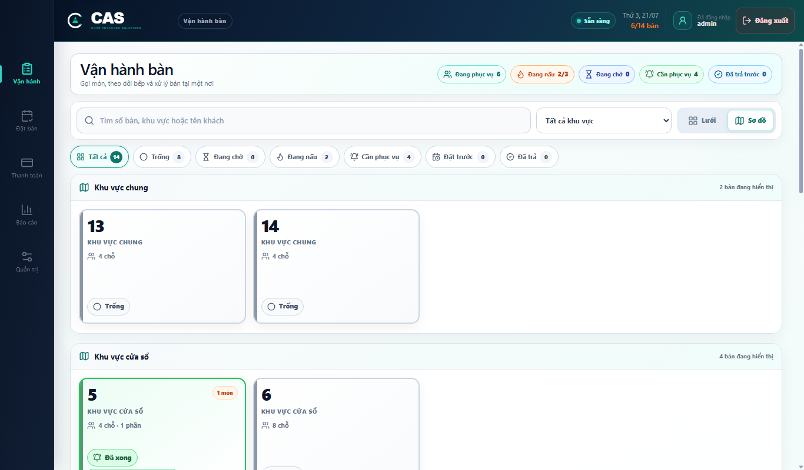
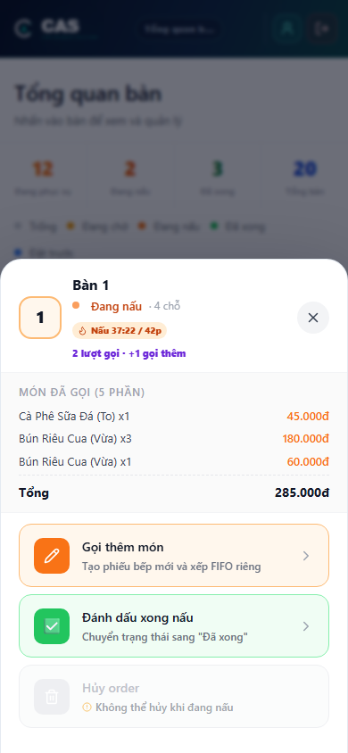
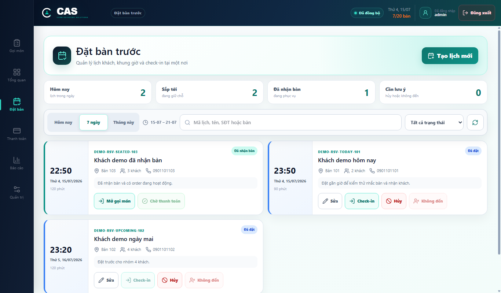
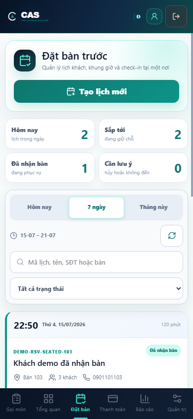
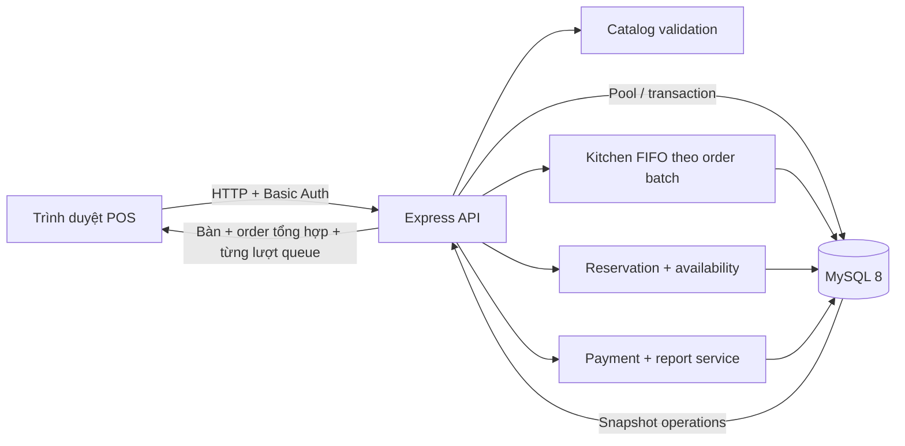
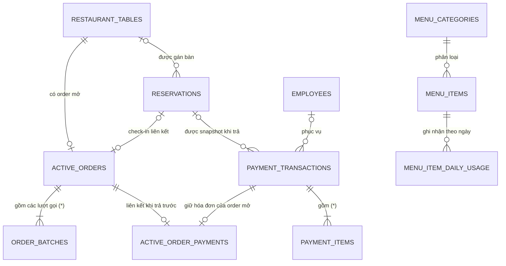

# Restaurant CASv2

Hệ thống POS và điều phối vận hành nhà hàng: đặt bàn, gọi món theo bàn, hàng đợi bếp FIFO, thanh toán, in phiếu/hóa đơn, báo cáo và quản trị. MySQL là nguồn dữ liệu nghiệp vụ; backend xác thực lại giá, tùy chọn món, ETA, tổng tiền và quan hệ đặt bàn trước khi ghi dữ liệu.

> **Mức độ hoàn thiện:** phù hợp chạy nội bộ hoặc MVP. Dự án chưa nên mở trực tiếp ra Internet trước khi hoàn thành các mục trong [Giới hạn và việc cần làm trước production](#giới-hạn-và-việc-cần-làm-trước-production).

## Mục lục

- [Bắt đầu nhanh](#bắt-đầu-nhanh)
- [Tính năng chính](#tính-năng-chính)
- [Kiến trúc](#kiến-trúc)
- [Cấu trúc thư mục](#cấu-trúc-thư-mục)
- [Cấu hình môi trường](#cấu-hình-môi-trường)
- [Database và quan hệ dữ liệu](#database-và-quan-hệ-dữ-liệu)
- [Luồng nghiệp vụ](#luồng-nghiệp-vụ)
- [API chính](#api-chính)
- [Scripts và kiểm thử](#scripts-và-kiểm-thử)
- [Triển khai production](#triển-khai-production)
- [Giới hạn và việc cần làm trước production](#giới-hạn-và-việc-cần-làm-trước-production)
- [Xử lý lỗi thường gặp](#xử-lý-lỗi-thường-gặp)

## Bắt đầu nhanh

Yêu cầu: Node.js `>=20.19`, npm `11.x` (repository khóa metadata ở `npm@11.13.0`) và MySQL `8.x`.

```powershell
npm install
Copy-Item apps/api/.env.example apps/api/.env
Copy-Item apps/web/.env.example apps/web/.env
```

Trên macOS/Linux, thay hai lệnh `Copy-Item` bằng:

```bash
cp apps/api/.env.example apps/api/.env
cp apps/web/.env.example apps/web/.env
```

Sau đó cập nhật ít nhất `DB_PASSWORD`, `AUTH_USERNAME` và `AUTH_PASSWORD` trong `apps/api/.env`, rồi chạy:

```powershell
npm run db:migrate
npm run dev:api
```

Mở terminal thứ hai:

```powershell
npm run dev:web
```

- Web: `http://localhost:5173`
- API health: `http://127.0.0.1:4100/api/health`
- Dữ liệu demo: chạy `npm run db:seed:test` **chỉ trên database development/test**.

## Tổng quan

| Thành phần | Công nghệ | Vai trò |
|---|---|---|
| Web | React 18, TypeScript, Vite | Đặt bàn, gọi món, bếp, thanh toán, báo cáo và quản trị |
| API | Node.js, Express | Xác thực, validation, transaction, đặt bàn và nghiệp vụ queue |
| Database | MySQL 8, InnoDB | Catalog, bàn, lịch đặt, order đang mở, cấu hình và giao dịch |
| Biểu đồ | Recharts, lazy-loaded | Báo cáo doanh thu và hóa đơn theo giờ/ngày/tuần |
| Giao diện | CSS responsive, Lucide | Desktop, tablet, mobile, phiếu bếp 80 mm và hóa đơn A4 |

| Quality gate gần nhất | Kết quả ngày 21/07/2026 |
|---|---:|
| Unit test backend | `30/30` đạt |
| Database audit read-only | `33/33` nhóm đạt |
| TypeScript | Đạt |
| Production build | Đạt |
| Smoke test API/MySQL | Đạt trên database test |

Các kết quả trên có thể tái lập bằng lệnh trong [Scripts và kiểm thử](#scripts-và-kiểm-thử); đây không phải badge CI vì repository hiện chưa có pipeline CI.

## Ảnh giao diện


<details>
<summary>Xem toàn bộ ảnh desktop/mobile</summary>

### Đăng nhập


### Sơ đồ mặt bằng



### Gọi món và ETA trên mobile

<p align="center">
  
</p>

### Modal bàn trên mobile

<p align="center">
  
</p>

### Điều phối bếp và quản trị


### Báo cáo


### Đặt bàn



<p align="center">
  
</p>

</details>

## Tính năng chính

- **Vận hành bàn:** một màn hình thống nhất để tìm/lọc bàn, xem lưới hoặc sơ đồ khu vực, gọi món, gọi thêm và theo dõi trạng thái bếp/đã thanh toán.
- **Đặt bàn:** kiểm tra sức chứa và chồng lịch trong transaction; hỗ trợ `booked`, `seated`, `completed`, `cancelled` và `no_show`.
- **Order theo lượt:** `active_orders` giữ bill tổng hợp, còn mỗi lần gọi tạo một `order_batch` FIFO riêng để sửa, in và điều phối bếp.
- **Hạn mức món theo ngày:** giữ số phần khi gửi bếp, cập nhật chênh lệch khi sửa phiếu chờ, hoàn khi hủy order toàn `waiting` và tự dùng bucket mới theo `BUSINESS_TIME_ZONE`.
- **Bếp:** FIFO, giới hạn số batch nấu song song, tự động/thủ công/tạm dừng, tự hoàn tất theo ETA, cảnh báo quá hạn và chống thao tác từ snapshot cũ bằng `batchId/version`.
- **ETA tin cậy:** backend tính từ catalog MySQL theo `cookMinutes × quantity`; timer giao diện hiệu chỉnh bằng `serverNow`.
- **Thanh toán:** tiền mặt, thẻ hoặc QR; trả sau đóng bàn ngay, trả trước giữ queue và bàn đến khi nhân viên xác nhận khách rời.
- **In ấn:** phiếu bếp 80 mm riêng cho từng lượt gọi và hóa đơn A4 tổng hợp cố định.
- **Quản trị:** bàn/khu vực, thực đơn, hạn mức ngày, thời gian nấu, nhân viên/ca, cấu hình bếp và thương hiệu.
- **Báo cáo:** Ngày–Tuần–Tháng theo kỳ lịch sử, KPI, phương thức, món, danh mục và nhân viên từ hóa đơn đã thanh toán.
- **Đa thiết bị và responsive:** polling có timeout, dừng khi tab ẩn, Browser Back/Forward cho các bước chính, touch target 44 px và hỗ trợ `prefers-reduced-motion`.

## Công thức ETA

Với mỗi dòng giỏ hàng:

```text
ETA dòng món = thời gian nấu một phần × số lượng
ETA order     = max(ETA của các dòng món)
```

Ví dụ:

```text
Phở bò: 12 phút × 3 = 36 phút
Gà nướng: 25 phút × 2 = 50 phút
ETA order = max(36, 50) = 50 phút
```

Công thức giả định các loại món khác nhau có thể được chế biến song song, nhưng nhiều phần giống nhau trên cùng một dòng cần thêm thời gian tuyến tính. Frontend chỉ hiển thị preview; backend tính lại ETA từ catalog MySQL và số lượng đã validation.

## Kiến trúc



Các nguyên tắc chính:

1. MySQL là nguồn sự thật; UI polling snapshot `/api/operations` mỗi 3 giây.
2. `active_orders` giữ giỏ hàng tổng hợp của bàn; `order_batches` giữ từng lượt gọi độc lập để điều phối và in phiếu bếp.
3. Những thao tác thay đổi order, queue hoặc payment đều khóa dữ liệu cần thiết bằng transaction InnoDB.
4. Queue được đồng bộ bằng khóa `kitchen_queue_state FOR UPDATE`, không phụ thuộc state trong RAM của một API instance.
5. Toàn bộ timestamp queue và đặt bàn được lưu, so sánh theo UTC; `/api/operations` trả thêm `serverNow` để UI hiệu chỉnh đồng hồ hiển thị.
6. Giá, tùy chọn món, tổng thanh toán và ETA đều được backend tính lại.
7. Lịch đặt bàn chống chồng lấn bằng validation, index và khóa transaction; lịch tương lai chỉ xuất hiện dưới dạng `nextReservation`, không chiếm bàn cả ngày.
8. `/api/operations` đọc bàn/order/batch/config/đặt bàn gần nhất trong một repeatable-read snapshot duy nhất.
9. Thanh toán trước được liên kết 1–1 với active order qua `active_order_payments`; hóa đơn đã chốt không thay đổi trong khi queue bếp tiếp tục hoàn tất các batch còn lại.
10. Hạn mức món được khóa theo cặp `(menu_item_id, business_date)` trong cùng transaction tạo/sửa/hủy order. Cách khóa theo thứ tự ngày và id ngăn hai máy POS cùng bán phần cuối; `/api/operations` đồng bộ phần còn lại giữa các thiết bị mà không phải tải lại toàn bộ catalog.

## Cấu trúc thư mục

```text
Restaurant_CASv2/
├─ apps/
│  ├─ api/
│  │  ├─ src/
│  │  │  ├─ server.js            # HTTP, auth, endpoint và transaction orchestration
│  │  │  ├─ db.js                # Pool, bootstrap schema và migration tương thích
│  │  │  ├─ domain.js            # Validation order/settings và công thức payment
│  │  │  ├─ catalog.js           # Catalog, canonicalization và ETA
│  │  │  ├─ dailyInventory.js     # Hạn mức món theo ngày, giữ/hoàn số phần trong transaction
│  │  │  ├─ kitchenQueue.js      # Điều phối FIFO có khóa database
│  │  │  ├─ reservation.js       # Chuẩn hóa, overlap và vòng đời đặt bàn
│  │  │  ├─ orderPolicy.js       # Quy tắc hủy order và thanh toán theo batch
│  │  │  └─ defaultSettings.js
│  │  ├─ scripts/
│  │  │  ├─ smoke.mjs            # Smoke test qua API + MySQL thật
│  │  │  ├─ seed-test-data.mjs   # Dữ liệu demo idempotent cho dev/test
│  │  │  └─ audit-db.mjs         # Audit toàn vẹn 33 nhóm ở chế độ READ ONLY
│  │  └─ test/                    # Unit test nghiệp vụ
│  └─ web/
│     ├─ public/brand/            # Asset được Vite phục vụ trực tiếp
│     └─ src/
│        ├─ app/App.tsx           # Điều phối state, polling và navigation
│        ├─ app/data.ts           # Type, seed catalog và helper giỏ hàng
│        ├─ app/reporting.ts      # Dựng timeline giờ/ngày/tuần và báo cáo nhân viên
│        ├─ app/services/api.ts   # HTTP client có auth, timeout và chuẩn hóa lỗi
│        ├─ app/config/           # Brand/settings dùng chung
│        ├─ app/components/       # Màn hình nghiệp vụ
│        │  └─ ReservationsPage.tsx # Quản lý lịch đặt bàn và check-in
│        └─ styles/                # Theme, responsive và hiệu ứng
├─ database/schema.sql            # Schema bootstrap thủ công
├─ docs/screenshots/              # Ảnh thật dùng trong README
├─ assets/brand/                   # Asset thương hiệu gốc/chất lượng nguồn
├─ assets/invoice-template-source/ # Bản nguồn tham khảo của mẫu hóa đơn
├─ package.json                    # npm workspaces
└─ README.md
```

### Quy ước source

- `apps/api` và `apps/web` là hai workspace backend/frontend độc lập.
- Module API được tách theo nghiệp vụ (`catalog`, `dailyInventory`, `kitchenQueue`, `reservation`, `orderPolicy`); `server.js` chỉ điều phối HTTP và transaction.
- `assets/brand` chứa nguồn thương hiệu; `apps/web/public/brand` chứa bản được Vite phục vụ runtime.
- Khi component vượt quá một feature rõ ràng, ưu tiên tách theo feature thay vì tạo thư mục tiện ích chung không có chủ sở hữu.

## Cấu hình môi trường

### Yêu cầu

- Node.js `>= 20.19`
- npm `11.x`; phiên bản khai báo trong repository là `11.13.0`
- MySQL `8.x`
- Windows, macOS hoặc Linux

### Cài đặt chi tiết

Tại thư mục gốc:

```powershell
npm install
Copy-Item apps/api/.env.example apps/api/.env
Copy-Item apps/web/.env.example apps/web/.env
```

Chỉnh `apps/api/.env` trước khi chạy. Không commit `.env`; các file này đã nằm trong `.gitignore`.

### Biến môi trường API

| Biến | Mặc định mẫu | Ý nghĩa |
|---|---:|---|
| `NODE_ENV` | `development` khi không đặt | Dùng `production` khi deploy; production bắt buộc cấu hình auth và mặc định không tự migrate |
| `PORT` | `4100` | Cổng API |
| `HOST` | `0.0.0.0` | Cho phép máy khác trong LAN kết nối |
| `CORS_ORIGIN` | `http://localhost:5173` | Allowlist origin production, phân cách bằng dấu phẩy |
| `CORS_ALLOW_PRIVATE_NETWORK` | `true` | Chỉ development: cho localhost/IPv6/IP LAN riêng |
| `AUTH_USERNAME` | `admin` | Tài khoản POS |
| `AUTH_PASSWORD` | bắt buộc đổi | Mật khẩu dài và ngẫu nhiên |
| `KITCHEN_CONCURRENCY` | `2` | Công suất bếp khởi tạo |
| `KITCHEN_STALE_MINUTES` | `120` | Khoảng gia hạn sau ETA trước khi cảnh báo batch quá hạn |
| `BUSINESS_TIME_ZONE` | `Asia/Ho_Chi_Minh` | Múi giờ xác định ngày kinh doanh và thời điểm đặt lại số phần món |
| `DB_HOST` | `127.0.0.1` | Máy chủ MySQL |
| `DB_PORT` | `3306` | Cổng MySQL |
| `DB_USER` | `root` | User MySQL local |
| `DB_PASSWORD` | bắt buộc đổi | Mật khẩu MySQL |
| `DB_NAME` | `restaurant_casv2` | Tên database |
| `DB_AUTO_MIGRATE` | `true` | Tự bootstrap/migrate khi phát triển |
| `DB_CONNECTION_LIMIT` | `10` | Số connection tối đa trong pool |
| `DB_QUEUE_LIMIT` | `100` | Số request chờ connection |
| `DB_CONNECT_TIMEOUT_MS` | `10000` | Timeout mở kết nối MySQL, tính bằng mili giây |
| `LEGACY_TIMEZONE_OFFSET_MINUTES` | `420` | Chỉ dùng một lần khi đổi timestamp legacy sang UTC |

Đặt cùng một `BUSINESS_TIME_ZONE` cho mọi API instance của nhà hàng. Ngày kinh doanh được tính ở backend theo biến này, không theo múi giờ của máy POS hoặc MySQL session; mỗi ngày có một dòng usage riêng nên không cần tiến trình reset chạy lúc nửa đêm.

### Biến môi trường web

| Biến | Giá trị | Ý nghĩa |
|---|---|---|
| `VITE_API_BASE_URL` | để trống | Dùng `/api` cùng domain hoặc Vite proxy |
| `VITE_DEV_API_TARGET` | `http://127.0.0.1:4100` | Đích proxy dev; cấu hình hiện đọc từ environment của tiến trình Vite, vì vậy hãy export/set biến trước khi chạy nếu cần đổi |

## Database và quan hệ dữ liệu

### Migration

`db:migrate` là lệnh chuẩn cho cả database mới và database đang nâng cấp. Hãy backup trước khi chạy trên môi trường có dữ liệu thật; migration có thể chuẩn hóa dữ liệu và loại bỏ cột legacy không còn dùng.

```powershell
npm run db:migrate
```

`db:schema` chỉ bootstrap thủ công một database **mới** tên `restaurant_casv2` bằng MySQL CLI:

```powershell
npm run db:schema
```

Lệnh này hỏi mật khẩu tương tác và không đặt mật khẩu trên command line. Do `schema.sql` dùng `CREATE TABLE IF NOT EXISTS`, nó không thay thế migration/backfill cho database hiện hữu và không tôn trọng `DB_NAME` tùy chỉnh.

### Nạp dữ liệu đầy đủ để test

```powershell
npm run db:seed:test
```

Script chỉ làm mới dữ liệu sở hữu bởi tiền tố `demo-` và có thể chạy lại nhiều lần. Tuy vậy, đây vẫn là script ghi dữ liệu: chỉ dùng trên development/staging hoặc một database test riêng, không chạy trên production.

| Dữ liệu mẫu | Nội dung |
|---|---|
| Bàn `101–108` | Bàn trống và bàn có order ở nhiều trạng thái; lịch đặt được lưu riêng, không giả lập bằng trạng thái bàn |
| Đặt bàn | Lịch demo đủ các trạng thái `booked`, `seated`, `completed`, `cancelled`, `no_show`, gồm lịch sắp tới để test `nextReservation` |
| Order | 5 order đang mở, 7 batch, gồm 2 bàn có lượt gọi thêm |
| Queue | ETA tính từ `cookMinutes × quantity`, gồm batch chờ, đã xong và lượt gọi thêm |
| Thanh toán | 6 hóa đơn gần thời điểm hiện tại, đủ tiền mặt, thẻ và QR |
| Nhân viên | 3 nhân viên phục vụ demo theo các ca khác nhau; hóa đơn được gán nhân viên |
| Catalog | Nhóm `Món demo số lượng` có 8 món không giới hạn cho các luồng order, một món giới hạn 20 phần/còn 6 và một món giới hạn 8 phần/đã hết để kiểm thử UI còn hàng–hết hàng |

### Quan hệ dữ liệu



`(*)` biểu thị invariant 1..n do transaction API và `db:audit` duy trì; bản thân FK chỉ ngăn child mồ côi. `restaurant_settings` và `kitchen_queue_state` là hai singleton độc lập với `id=1`, không có self-reference.

| Bảng | Vai trò | Ràng buộc/index đáng chú ý |
|---|---|---|
| `restaurant_tables` | Số bàn, ghế, trạng thái, khu vực và tọa độ `X/Y` dùng dựng sơ đồ mặt bằng | PK `id`, unique `table_number`, index `status`; `X/Y` cùng để trống hoặc trong `1..24`, unique `(area, position_x, position_y)` chống hai bàn trùng ô |
| `reservations` | Khách, điện thoại chuẩn hóa, số khách, bàn, thời điểm bắt đầu/kết thúc và vòng đời đặt bàn | FK bàn, unique marker `seated_table_id` bảo đảm tối đa một lịch đang nhận khách/bàn, CHECK thời lượng/vòng đời, `version` optimistic và index lịch |
| `active_orders` | Giỏ hàng tổng hợp đang mở của mỗi bàn, dùng khi thanh toán | unique `table_id`, optional unique `reservation_id`, FK bàn/đặt bàn; xóa order sẽ cascade các batch |
| `order_batches` | Từng lượt gọi/gọi thêm và trạng thái bếp riêng | unique `(order_id, batch_number)`, index FIFO `(status, queued_at, id)`; `inventory_date` cố định bucket ngày đã giữ số phần |
| `kitchen_queue_state` | Công suất/chế độ queue và phiên bản cấu hình | Một hàng `id=1`, `version` optimistic, khóa bằng `FOR UPDATE` |
| `menu_categories` | Danh mục món | PK `id`, thứ tự và trạng thái active |
| `menu_items` | Giá, ETA, size, topping và hạn mức số phần/ngày | FK category, index category/available; `daily_limit` nullable, `NULL` nghĩa là không giới hạn |
| `menu_item_daily_usage` | Số phần đã giữ của từng món theo ngày kinh doanh | PK `(menu_item_id, business_date)`, FK món `ON DELETE CASCADE`, index `(business_date, menu_item_id)` |
| `restaurant_settings` | Thương hiệu và hóa đơn | JSON, một hàng `id=1` |
| `employees` | Hồ sơ, vai trò, số điện thoại và ca làm | unique `employee_code`, soft deactivate |
| `payment_transactions` | Header hóa đơn đã trả, snapshot nhân viên/khách và trạng thái phục vụ sau thanh toán | unique `invoice_code`, `service_status` chỉ nhận `awaiting_departure/closed`, `departure_confirmed_at`, optional FK đặt bàn, index `paid_at/staff_id` và `(service_status, table_id)` |
| `active_order_payments` | Liên kết tạm hóa đơn trả trước với order vẫn đang phục vụ | PK/FK `order_id`, unique/FK `transaction_id`; một order và một hóa đơn chỉ có tối đa một liên kết |
| `payment_items` | Chi tiết món và snapshot danh mục đã thanh toán | FK transaction, index category, `ON DELETE CASCADE` |
| `schema_migrations` | Đánh dấu migration dữ liệu | PK migration id |

### Chính sách quan hệ và dữ liệu lịch sử

- `reservations.table_id` dùng `ON DELETE SET NULL`; `table_number` vẫn giữ snapshot để lịch sử còn đọc được sau khi bàn bị xóa.
- `active_orders → order_batches` và `payment_transactions → payment_items` dùng `ON DELETE CASCADE` vì child không có ý nghĩa độc lập. API chặn xóa bàn đang phục vụ hoặc còn lịch mở; không nên thao tác xóa trực tiếp bằng SQL.
- `active_order_payments` là quan hệ 1–1: xóa order sẽ xóa liên kết, còn xóa payment đang được liên kết bị `RESTRICT`.
- `payment_transactions.table_id/table_number` và `payment_items.menu_item_id/category_id` là snapshot lịch sử có chủ ý, không FK tới bàn/catalog để hóa đơn không hỏng khi cấu hình thay đổi.
- `reservations.seated_table_id` là unique marker, không phải FK. API và `db:audit` buộc nó bằng `table_id` khi trạng thái là `seated` và đặt `NULL` ở trạng thái khác.
- Chồng lịch không thể biểu diễn bằng FK/CHECK MySQL; API khóa hàng bàn bằng transaction khi kiểm tra khoảng thời gian, còn audit phát hiện mọi lịch mở bị giao nhau.

### Kết quả rà soát database

Ngày 21/07/2026, database MySQL `8.0.46` đang chạy có `14` bảng và `11` khóa ngoại. `npm run db:audit` đạt `33/33` nhóm ở chế độ `READ ONLY`: không có bản ghi mồ côi, batch gắn sai bàn, order lệch tổng hợp, lịch mở chồng nhau, hóa đơn trả trước mất liên kết hoặc ledger món thấp hơn số phần đang hoạt động. Đối chiếu sâu bổ sung trên `13` active order/`15` batch cũng không phát hiện nội dung JSON sai hoặc `cartId` trùng.

Các giới hạn cấu trúc đã biết nhưng **không gây corruption trong dữ liệu hiện tại**:

1. CHECK reservation chưa tự buộc `seated_table_id = table_id`; invariant này hiện do API và audit giữ.
2. Audit tự động so số dòng/ETA của `active_orders.items` với batch, chưa so toàn bộ nội dung từng option; lần rà soát này đã đối chiếu nội dung riêng và đạt.
3. `verifyDatabaseSchema()` khi `DB_AUTO_MIGRATE=false` chưa kiểm tra mọi FK/CHECK mà `db:audit` kiểm tra. Vì vậy deploy phải chạy cả `db:migrate` **và** `db:audit`.
4. `menu_item_daily_usage` là số tổng hợp theo ngày, chưa phải immutable movement ledger; phù hợp hạn mức thành phẩm nhưng chưa thay thế kiểm toán tồn kho nguyên liệu.

Script audit chỉ đọc, lấy tối đa tám mẫu cho mỗi loại vi phạm và trả exit code khác `0` nếu phát hiện lỗi.

## Chạy development

Mở hai terminal:

```powershell
npm run dev:api
```

```powershell
npm run dev:web
```

- Web: `http://localhost:5173`
- API health: `http://127.0.0.1:4100/api/health`

## Dùng trên điện thoại hoặc máy khác trong Wi-Fi

1. Chạy API và web như trên.
2. Dùng `ipconfig` để lấy IPv4 của máy chạy dự án.
3. Mở `http://<IPv4>:5173` trên thiết bị khác.
4. Cho phép Node.js qua Windows Firewall ở mạng Private nếu được hỏi.

Development cho phép `localhost`, `127.x`, IPv6 loopback, `10.x`, `192.168.x` và `172.16-31.x` khi `CORS_ALLOW_PRIVATE_NETWORK=true`. Production luôn yêu cầu origin nằm chính xác trong `CORS_ORIGIN`.

## Luồng nghiệp vụ

### Gọi món và queue bếp

1. Nhân viên tìm/lọc bàn trên màn **Vận hành bàn**, dùng lưới hoặc sơ đồ theo khu vực rồi mở cùng một modal thao tác. Client gửi danh sách món và số lượng; `append=false` tạo lượt đầu, `append=true` tạo lượt gọi thêm.
2. Backend validation giới hạn 1–100 dòng, mỗi dòng 1–99 phần.
3. Backend tải lại catalog theo id, thay toàn bộ giá/size/topping client bằng dữ liệu MySQL.
4. Trong cùng transaction gửi bếp, backend gộp số lượng theo `menuItem.id`, khóa bucket của ngày kinh doanh hiện tại và giữ số phần. Nếu không đủ, toàn bộ request rollback với `409 MENU_ITEM_DAILY_LIMIT_EXCEEDED`; hai máy POS không thể cùng nhận phần cuối.
5. Backend tính `ETA dòng = cookMinutes × quantity` và lấy dòng lâu nhất.
6. Backend nối món vào `active_orders` để giữ tổng bill và tạo một dòng `order_batches` chỉ chứa món của lượt mới; batch lưu `inventory_date` để mọi lần điều chỉnh dùng đúng bucket ngày.
7. Phiếu bếp của lượt mới có thể in riêng; batch được xếp cuối queue bằng `queued_at, id`.
8. Queue khóa `kitchen_queue_state`, đếm slot trống và lấy batch FIFO.
9. Batch được lấy chuyển `waiting → cooking` và ghi `cooking_started_at`; trạng thái bàn được suy ra từ tất cả batch của bàn.
10. Mỗi giây backend so sánh `cooking_started_at + estimated_cook_minutes` với thời gian UTC MySQL. Batch đủ ETA tự chuyển `cooking → done`.
11. Queue tự lấy batch FIFO tiếp theo nếu đang ở chế độ tự động. Bàn chỉ `done` khi không còn batch chờ/nấu; khi pause/manual, món hiện tại vẫn hoàn tất nhưng không tự lấy món mới.
12. Khi sửa, client gửi đúng `batchId`; transaction chỉ chấp nhận batch vẫn `waiting`, canonicalize lại món/ETA, điều chỉnh số phần theo chênh lệch và rebuild giỏ tổng từ toàn bộ batch. Nếu phiếu chờ được sửa sau khi đã sang ngày mới, phần cũ được trả về bucket cũ và nội dung mới được giữ ở bucket ngày hiện tại.
13. Hủy order chỉ hợp lệ khi tất cả batch còn `waiting`; transaction hoàn lại số phần đã giữ theo `inventory_date`. Batch đã `cooking` hoặc `done` không được hoàn hạn mức.
14. Trạng thái order không được ép qua CRUD bàn; mọi chuyển trạng thái phải đi qua action queue để không vượt công suất bếp.
15. Hoàn tất/đưa lại hàng chờ phải gửi đúng `expectedBatchId`; retry, bấm kép hoặc client dùng snapshot cũ không thể tác động nhầm phiếu kế tiếp.
16. Cấu hình bếp được cập nhật từng phần bằng `PATCH` kèm `expectedVersion`; backend khóa singleton và trả `409` nếu máy POS đang dùng phiên bản cũ, tránh ghi đè công suất/chế độ vừa được máy khác thay đổi.
17. Mỗi snapshot trả `serverNow`; frontend ước lượng độ lệch theo điểm giữa thời gian gửi–nhận request và dùng đồng hồ server đã hiệu chỉnh cho timer. Batch chỉ bị cảnh báo stale sau `ETA + KITCHEN_STALE_MINUTES`, không cảnh báo ngay khi vừa hết ETA.

### Đặt bàn trước

1. Nhân viên nhập tên, điện thoại, số khách, ngày/giờ, thời lượng 30–480 phút, bàn và ghi chú; giao diện chỉ đề xuất bàn đủ sức chứa và còn trống trong toàn bộ khoảng thời gian.
2. `POST /api/reservations` chuẩn hóa điện thoại, tính `ends_at` và kiểm tra overlap trong transaction. Hai máy đặt cùng một bàn/khung giờ đồng thời không thể cùng thành công.
3. Chỉ lịch `booked` được sửa; client gửi `expectedVersion`, vì vậy bản ghi cũ nhận `409` thay vì ghi đè thay đổi mới hơn.
4. Vòng đời hợp lệ là `booked → seated → completed` hoặc `booked → cancelled/no_show`. Check-in được phép sớm tối đa 60 phút; đánh dấu `no_show` sau 15 phút kể từ giờ hẹn.
5. Check-in chuyển lịch sang `seated`, mở đúng bàn để gọi món và liên kết `reservation_id` với active order. Không thể hoàn tất lịch `seated` khi bàn vẫn còn order mở.
6. Thanh toán luôn lưu snapshot mã đặt bàn, tên khách và số khách vào hóa đơn. Nếu trả sau khi món đã xong, lịch `seated` hoàn tất ngay; nếu trả trước, lịch vẫn giữ `seated` cho đến khi món xong và nhân viên xác nhận khách đã rời.
7. Lịch tương lai chỉ hiển thị trên thẻ bàn bằng `nextReservation`. Bàn chỉ được giữ khi khách đã `seated` hoặc lịch `booked` còn không quá 15 phút; lịch buổi tối không khóa bàn từ đầu ngày.

### Thanh toán

1. Client bật thanh toán cho mọi bàn có active order chưa trả tiền, kể cả khi batch còn `waiting` hoặc `cooking`; nhân viên chọn người phục vụ và client giữ ổn định mã idempotency trong mọi lần retry.
2. Backend kiểm tra giao dịch cùng mã đã tồn tại trước khi yêu cầu active order; retry sau timeout nhận lại kết quả cũ.
3. Backend khóa bàn/order/batch, từ chối order đã có hóa đơn và xác định có cần giữ bàn hay không. Cờ `payment.keepTableOpen` giữ nguyên ý định trả trước nếu bếp vừa hoàn tất trong lúc màn thanh toán đang mở.
4. Backend xác thực nhân viên còn hoạt động đúng vai trò Phục vụ, đọc settings và tính subtotal, discount, service fee, VAT, total.
5. Tất cả món từ mọi lượt gọi được ghi vào cùng header; item lưu snapshot danh mục để báo cáo lịch sử không đổi theo catalog. Nếu order đến từ đặt bàn, header đồng thời lưu snapshot khách và lịch đặt.
6. **Trả sau:** nếu mọi batch đã `done` và không yêu cầu giữ bàn, giao dịch nhận `service_status=closed`; active order bị xóa, lịch `seated` liên quan chuyển `completed` và bàn về `empty` trong cùng transaction. Đây là luồng cũ và vẫn được giữ nguyên.
7. **Trả trước:** khi còn batch `waiting/cooking`, hoặc client đã mở luồng trả trước với `keepTableOpen=true`, giao dịch nhận `service_status=awaiting_departure` và được liên kết với active order trong `active_order_payments`. Bàn tiếp tục ở trạng thái bếp thực tế, queue vẫn chạy, UI hiển thị **Đã thanh toán** và backend khóa gọi thêm, sửa hoặc hủy order.
8. Khi tất cả batch của bàn trả trước đã `done`, nhân viên gọi `POST /api/orders/:tableId/confirm-departure`. Backend xác thực trạng thái, đổi giao dịch sang `closed`, ghi `departure_confirmed_at`, hoàn tất lịch `seated`, xóa active order và đưa bàn về `empty`. Gọi lại endpoint an toàn theo cơ chế idempotent.
9. Response thanh toán trả `requiresDepartureConfirmation` và `orderClosed` để UI phân biệt hai nhánh. Chỉ sau khi transaction thanh toán commit thành công frontend mới cho in hóa đơn A4 tổng hợp.

### Báo cáo

| Kỳ | Khoảng dữ liệu | Trục hoành | Ví dụ nhãn |
|---|---|---|---|
| `Ngày` | 00:00–24:00 của ngày được chọn | 24 giờ | `00h`, `08h`, `16h`, `23h` |
| `Tuần` | Thứ Hai–Chủ nhật của tuần được chọn | 7 ngày | `T2 13/07`, `T3 14/07`, … |
| `Tháng` | Ngày đầu–cuối tháng được chọn | 4–6 tuần lịch, cắt đúng biên tháng | `01–05/07`, `06–12/07`, … |

- Người dùng chọn `Ngày`, `Tuần` hoặc `Tháng`, sau đó chọn trực tiếp một ngày/tuần/tháng lịch sử bất kỳ; các nút kỳ trước, kỳ sau và kỳ hiện tại hỗ trợ tra cứu nhanh. Tiêu đề luôn hiển thị rõ ngày đơn, khoảng đầu–cuối tuần hoặc tháng đang được tổng hợp.
- Mỗi lựa chọn gửi đúng biên `from/to` của kỳ đang chọn tới API, không phụ thuộc ngày hiện tại.
- Bucket tương lai để trống thay vì ghi `0`; tooltip luôn hiển thị đầy đủ giờ/ngày hoặc khoảng tuần và tên chỉ số tiếng Việt.
- Frontend gửi biên ngày địa phương dưới dạng UTC và `timezoneOffsetMinutes` để bucket giờ/ngày đúng múi giờ thiết bị POS.
- API trả đồng thời `hourly[]` và `daily[]` được aggregate trực tiếp từ `payment_transactions`; frontend zero-fill các mốc đã qua và gom `daily[]` thành tuần lịch cho kỳ Tháng.
- Tổng doanh thu/số hóa đơn của `daily[]` được smoke test đối chiếu với KPI; báo cáo không phụ thuộc danh sách payment giới hạn hoặc order đang mở.
- Danh mục/món dùng snapshot đã thanh toán; doanh thu nhân viên dùng header hóa đơn và `staff_id`.
- Biểu đồ Recharts chỉ được tải khi người dùng mở trang Báo cáo.
- Kỳ lịch sử đang xem được giữ nguyên khi trang mở xuyên nửa đêm; hệ thống không tự nhảy về hiện tại và làm mất ngữ cảnh tra cứu của nhân viên.

## API chính

Mọi endpoint `/api/*`, trừ health, đều yêu cầu Basic Auth trong production; development chỉ yêu cầu khi `AUTH_USERNAME` và `AUTH_PASSWORD` đã được cấu hình.

| Method | Endpoint | Chức năng |
|---|---|---|
| `GET` | `/api/health` | Kiểm tra API/MySQL |
| `GET` | `/api/auth/session` | Kiểm tra phiên Basic Auth |
| `GET/PUT` | `/api/settings` | Đọc/lưu cấu hình nhà hàng |
| `GET/POST` | `/api/employees` | Danh sách hoặc tạo nhân viên |
| `PUT/DELETE` | `/api/employees/:employeeId` | Sửa hoặc ngừng hoạt động nhân viên |
| `GET` | `/api/reservations?from=&to=&status=&q=&tableId=` | Tìm/lọc lịch đặt bàn trong khoảng thời gian |
| `GET` | `/api/reservations/availability?reservedAt=&durationMinutes=&partySize=` | Tìm bàn đủ sức chứa và không chồng lịch |
| `POST` | `/api/reservations` | Tạo lịch `booked` sau khi khóa và kiểm tra overlap |
| `PUT` | `/api/reservations/:reservationId` | Sửa lịch còn `booked` với `expectedVersion` |
| `PATCH` | `/api/reservations/:reservationId/status` | Check-in, hoàn tất, hủy hoặc đánh dấu vắng mặt theo vòng đời hợp lệ |
| `GET` | `/api/catalog` | Lấy danh mục/món; mỗi món trả `dailyLimit`, `dailyUsed`, `dailyRemaining` và `inventoryDate` của ngày kinh doanh hiện tại |
| `POST` | `/api/catalog/bootstrap` | Seed catalog nếu database trống |
| `POST` | `/api/categories` | Tạo danh mục |
| `PUT/DELETE` | `/api/categories/:categoryId` | Sửa hoặc ngừng dùng danh mục |
| `POST` | `/api/menu-items` | Tạo món |
| `PUT/DELETE` | `/api/menu-items/:itemId` | Sửa/ngừng bán món và cấu hình `dailyLimit` (`null` = không giới hạn, `0..1000000` = hạn mức/ngày) |
| `GET` | `/api/operations` | Snapshot nhất quán gồm `serverNow`, bàn/`nextReservation`, order, batch, cấu hình bếp, trạng thái thanh toán và `menuAvailability[]` để đồng bộ `dailyUsed/dailyRemaining` giữa các máy POS |
| `PUT` | `/api/orders/:tableId` | Tạo lượt đầu hoặc gọi thêm với body `{ items, append }`; giữ số phần theo ngày trong transaction |
| `PUT` | `/api/orders/:tableId/batches/:batchId` | Sửa đúng một phiếu bếp còn chờ, không đổi FIFO và cập nhật chênh lệch số phần |
| `POST` | `/api/orders/:tableId/requeue` | Đưa đúng `expectedBatchId` đang nấu về cuối queue |
| `DELETE` | `/api/orders/:tableId` | Hủy khi toàn bộ batch của order còn chờ và hoàn số phần theo bucket ngày của từng batch |
| `POST` | `/api/orders/:tableId/confirm-departure` | Xác nhận khách của order trả trước đã rời sau khi mọi batch `done`; đóng giao dịch/lịch đặt và giải phóng bàn, hỗ trợ retry idempotent |
| `PATCH/PUT` | `/api/kitchen/config` | Cập nhật công suất/chế độ/pause với `expectedVersion` |
| `POST` | `/api/kitchen/dispatch-next` | Lấy một order đầu queue |
| `POST` | `/api/tables` | Tạo bàn với số ghế, khu vực và tọa độ `positionX/positionY` |
| `PUT/DELETE` | `/api/tables/:tableId` | Sửa hoặc xóa bàn; trùng ô trong cùng khu vực trả `409 TABLE_POSITION_OCCUPIED` |
| `PATCH` | `/api/tables/:tableId/status` | Hoàn tất đúng `expectedBatchId` đang nấu; chống bấm lặp/client stale |
| `GET` | `/api/payments?from=&to=` | Giao dịch trong khoảng thời gian |
| `POST` | `/api/payments` | Thanh toán active order ở trạng thái chờ/nấu/đã xong; hỗ trợ `payment.keepTableOpen`, idempotent theo invoice và trả `requiresDepartureConfirmation`, `orderClosed` |
| `GET` | `/api/reports/summary?from=&to=&timezoneOffsetMinutes=` | Aggregate KPI, `hourly[]`, `daily[]`, phương thức, món, danh mục và nhân viên |

## Scripts và kiểm thử

| Lệnh | Tác dụng |
|---|---|
| `npm run dev:api` | API với Node watch mode |
| `npm run dev:web` | Vite dev server trên `0.0.0.0` |
| `npm run start:api` | Chạy API không watch, dùng cho process manager production |
| `npm run db:migrate` | Bootstrap/migrate MySQL |
| `npm run db:schema` | Bootstrap thủ công database mới `restaurant_casv2`; không nâng cấp DB cũ |
| `npm run db:seed:test` | Ghi/làm mới dữ liệu demo trên database development/test |
| `npm run db:audit` | Kiểm tra 33 nhóm ràng buộc và toàn vẹn ở chế độ READ ONLY |
| `npm run typecheck` | TypeScript strict check |
| `npm test` | Unit test backend |
| `npm run test:smoke` | Test end-to-end qua API đang chạy; có ghi dữ liệu test |
| `npm run build` | Build frontend production |
| `npm run check` | Typecheck + unit test + build |
| `npm audit --audit-level=high` | Audit dependency |

### Quality gates không ghi dữ liệu nghiệp vụ

```powershell
npm run check
npm run db:audit
npm audit --audit-level=high
```

`npm run check` gồm typecheck, unit test và production build. `db:audit` chỉ đọc database. `npm audit` cần kết nối npm registry và nên được chạy trong CI khi dự án bổ sung pipeline.

Phạm vi unit test hiện tại:

- `30/30` test nghiệp vụ đang đạt.
- Canonicalization catalog và chống giả giá/topping.
- Validation category, menu, quantity, VAT và thời gian nấu.
- Hạn mức món theo ngày: xác định ngày kinh doanh, gộp số lượng cùng món, giữ đúng phần cuối, từ chối vượt mức, điều chỉnh khi sửa phiếu chờ và hoàn khi hủy.
- ETA theo số lượng và lấy dòng lâu nhất.
- Queue batch đủ slot, pause, manual và automatic.
- Tự hoàn tất tất cả batch chạy đủ ETA và đồng bộ lại trạng thái bàn.
- Cảnh báo batch stale chỉ sau ETA cộng khoảng gia hạn cấu hình.
- Công thức payment và thời gian server.
- Validation nhân viên, vai trò, ca làm và mã nhân viên.
- Chuẩn hóa lịch đặt bàn, số điện thoại, thời lượng, sức chứa, phát hiện overlap và các chuyển trạng thái hợp lệ/không hợp lệ.
- Policy chỉ hủy order toàn-waiting; xác định đúng khi nào thanh toán cần giữ bàn, gồm trường hợp `keepTableOpen=true` trong lúc bếp vừa chuyển từ đang nấu sang đã xong.

### Smoke test API/MySQL

Smoke test tạo bàn, reservation, order, payment và tạm thay đổi cấu hình bếp. Cleanup khôi phục cấu hình và xóa dữ liệu có thể xóa, nhưng một phần lịch sử payment/reservation vẫn được giữ để kiểm tra báo cáo. **Chỉ chạy trên database test riêng; không chạy trên production.**

1. Chạy `npm run db:migrate` và bảo đảm catalog có dữ liệu, hoặc chạy `npm run db:seed:test`.
2. Mở API trong terminal riêng bằng `npm run dev:api`.
3. Chạy:

```powershell
$env:SMOKE_API_URL='http://127.0.0.1:4100/api'
npm run test:smoke
```

Trên macOS/Linux:

```bash
SMOKE_API_URL=http://127.0.0.1:4100/api npm run test:smoke
```

Smoke test bao phủ cạnh tranh đặt bàn, optimistic version bếp, FIFO/ETA, sửa phiếu chờ, hai request cùng giành phần cuối của món, thanh toán trước/sau, idempotency và đối chiếu báo cáo.

## Hiệu năng và giao diện

Kích thước từ `npm run build` ngày 21/07/2026; đây là số artifact, không phải SLA runtime:

| Artifact | Kích thước / gzip |
|---|---:|
| Main JS | `218,67 KB / 68,50 KB` |
| CSS dùng chung | `57,24 KB / 12,08 KB` |
| Chunk biểu đồ, chỉ tải khi mở Báo cáo | `395,08 KB / 108,86 KB` |
| Chunk Đặt bàn JS | `21,23 KB / 6,73 KB` |
| Chunk Đặt bàn CSS | `11,84 KB / 2,84 KB` |
| Chunk Thanh toán CSS | `5,85 KB / 1,65 KB` |

- Các trang nghiệp vụ lớn và Recharts được lazy-load; ảnh menu ngoài viewport dùng lazy decoding.
- Polling dừng khi tab ẩn, không cho request chồng nhau và timeout sau 12 giây.
- Snapshot `/api/operations` dùng repeatable-read transaction; queue và báo cáo có index tương ứng.
- Giao diện dùng grid responsive, touch target chính tối thiểu 44 px, portal cho modal và hỗ trợ `prefers-reduced-motion`.
- Phiếu bếp giữ khổ 80 mm; hóa đơn giữ bố cục A4 và cuộn ở viewport hẹp.

Repository chưa có Lighthouse CI, benchmark tải hoặc SLA. Trước production cần đo lại trên URL deploy thật và thiết bị POS/máy in mục tiêu, gồm Lighthouse, WCAG contrast, bàn phím, CPU/RAM API và p95 dưới tải đồng thời.

## Triển khai production

Repository không kèm Dockerfile hoặc cấu hình cloud. Mô hình được hỗ trợ trực tiếp là: host tĩnh `apps/web/dist`, chạy API Node.js bằng process manager và dùng MySQL 8 riêng.

### 1. Chuẩn bị release

```bash
npm ci
npm run check
```

Tạo `apps/api/.env` bằng secret của môi trường deploy. Các giá trị tối thiểu cần rà soát:

```dotenv
NODE_ENV=production
HOST=127.0.0.1
PORT=4100
CORS_ORIGIN=https://pos.example.com
AUTH_USERNAME=replace-me
AUTH_PASSWORD=replace-with-a-long-random-secret
BUSINESS_TIME_ZONE=Asia/Ho_Chi_Minh
DB_HOST=private-mysql-host
DB_PORT=3306
DB_USER=restaurant_app
DB_PASSWORD=replace-me
DB_NAME=restaurant_casv2
DB_AUTO_MIGRATE=false
```

Không commit file này. `AUTH_PASSWORD` và tài khoản MySQL phải được cấp qua secret manager của hạ tầng.

### 2. Backup, migrate và audit

1. Backup database và xác minh có thể restore.
2. Chạy migration bằng user MySQL tạm thời có quyền DDL:

```bash
npm run db:migrate
npm run db:audit
```

3. Sau khi đạt audit, chạy API bằng user MySQL runtime quyền tối thiểu và giữ `DB_AUTO_MIGRATE=false`.

Không chạy `db:seed:test` hoặc `test:smoke` trên production.

### 3. Build và phục vụ frontend

Cùng domain là cấu hình đơn giản nhất: để `VITE_API_BASE_URL` trống, sau đó chạy `npm run build` và phục vụ thư mục `apps/web/dist`. Static server phải fallback mọi route frontend về `index.html`.

Ví dụ Nginx tối thiểu:

```nginx
server {
  listen 443 ssl;
  server_name pos.example.com;
  root /srv/restaurant-cas/apps/web/dist;

  location / {
    try_files $uri $uri/ /index.html;
  }

  location /api/ {
    proxy_pass http://127.0.0.1:4100;
    proxy_set_header Host $host;
    proxy_set_header X-Forwarded-For $proxy_add_x_forwarded_for;
    proxy_set_header X-Forwarded-Proto $scheme;
  }
}
```

Nếu frontend và API khác domain, đặt `VITE_API_BASE_URL=https://api.example.com/api` **trước lúc build** và thêm đúng origin frontend vào `CORS_ORIGIN`.

### 4. Chạy API và xác minh

Chạy API bằng systemd, PM2 hoặc process manager tương đương:

```bash
npm run start:api
```

Sau deploy, kiểm tra:

```text
GET https://pos.example.com/api/health  -> 200, { ok: true, database: "connected" }
```

Sau đó đăng nhập, thực hiện một luồng thử trên dữ liệu kiểm thử được kiểm soát và kiểm tra log/monitor. Giữ release frontend trước để rollback nhanh; thay đổi database hiện chưa có migration rollback tự động nên backup là bắt buộc.

## Giới hạn và việc cần làm trước production

Giới hạn hiện tại:

- Basic Auth chỉ có một vai trò `admin`; chưa có phân quyền quản lý/thu ngân/phục vụ/bếp.
- Thanh toán thẻ/QR là ghi nhận nội bộ, chưa tích hợp terminal/callback đối soát, void hoặc hoàn tiền.
- Repository chưa có CI, browser E2E, Lighthouse CI, Dockerfile/Compose hay cấu hình cloud cụ thể.
- Schema được mô tả ở cả `db.js` và `database/schema.sql`; thay đổi lớn có nguy cơ drift nếu không cập nhật đồng thời.
- Order/batch lưu item dạng JSON và hạn mức món dùng ledger tổng hợp; chưa có movement ledger bất biến hoặc tồn kho nguyên liệu.
- Frontend đồng bộ bằng polling 3 giây; chưa có offline queue hoặc cơ chế phục hồi khi mạng nội bộ mất lâu.

Ưu tiên bắt buộc trước khi mở ra Internet:

1. Thay Basic Auth bằng session cookie `HttpOnly/Secure/SameSite` hoặc OIDC và thêm RBAC.
2. Dùng migration tool có version/rollback, backup/restore drill và một manifest chung cho schema verifier/audit.
3. Gia cố CHECK lifecycle reservation, mở rộng audit so nội dung order–batch đầy đủ và chặn ledger underflow.
4. Bổ sung audit log cho đổi giá, cấu hình bếp, hủy order, thanh toán và thao tác quản trị.
5. Thêm CI gồm `npm ci`, `npm run check`, database test, `db:audit`, browser E2E và accessibility.
6. Tích hợp payment gateway/POS thật, idempotency key phía nhà cung cấp, callback xác minh và quy trình hoàn tiền.

Mở rộng nghiệp vụ khi cần: chuẩn hóa `active_order_items`, tồn kho nguyên liệu/định mức, chuyển hoặc ghép bàn, tách/gộp hóa đơn, chia thanh toán, waitlist và SMS/Zalo nhắc lịch. Khi số client tăng, cân nhắc SSE/WebSocket; nếu POS phải chạy khi mất mạng, cần PWA/offline queue có chiến lược giải quyết xung đột.

## Bảo mật production

- Chạy API sau HTTPS/reverse proxy; không dùng Basic Auth qua HTTP công cộng.
- Đặt `NODE_ENV=production`, password/secret qua secret manager.
- Production phải đặt allowlist `CORS_ORIGIN` cụ thể; không bật private-network wildcard.
- Chạy migration bằng user có quyền DDL, sau đó đặt `DB_AUTO_MIGRATE=false`.
- API runtime nên dùng MySQL user quyền tối thiểu.
- Thiết lập backup, restore drill, log tập trung và monitor `/api/health`.
- Giới hạn truy cập MySQL ở private network và bật firewall.

## Xử lý lỗi thường gặp

### Vite báo `proxy error` hoặc `ECONNREFUSED 127.0.0.1:4100`

Frontend đang chạy nhưng không kết nối được API tại đích proxy.

1. Mở terminal khác và chạy `npm run dev:api`.
2. Kiểm tra `http://127.0.0.1:4100/api/health` trả `200`.
3. Nếu API dùng port khác, set `VITE_DEV_API_TARGET` trong environment của tiến trình Vite rồi restart `npm run dev:web`.
4. Nếu API dừng vì MySQL, xử lý lỗi database trước; Vite chỉ chuyển tiếp request và không tự khởi động backend.

### `Origin không được phép`

- Development: kiểm tra `CORS_ALLOW_PRIVATE_NETWORK=true`, restart API và chắc chắn origin thuộc localhost/IP LAN riêng.
- Production: thêm chính xác protocol, host và port frontend vào `CORS_ORIGIN`, ví dụ `https://pos.example.com`.
- Nếu dùng Vite proxy và `VITE_API_BASE_URL` để trống, trình duyệt chỉ gọi cùng origin `/api`, thường không cần CORS trực tiếp.

### API trả `503 DATABASE_UNAVAILABLE`

- Kiểm tra MySQL đang chạy.
- Kiểm tra `DB_HOST`, `DB_PORT`, `DB_USER`, `DB_PASSWORD`, `DB_NAME`.
- Chạy `npm run db:migrate` và xem log API.

### Đăng nhập luôn thất bại

- Kiểm tra `AUTH_USERNAME`, `AUTH_PASSWORD` trong `apps/api/.env`.
- Restart API sau khi đổi `.env`.
- Credential chỉ lưu trong `sessionStorage`; mở tab mới cần đăng nhập lại.

### Điện thoại không mở được web

- Dùng IPv4 của máy chạy Vite, không dùng `localhost` trên điện thoại.
- Cả hai thiết bị phải cùng mạng.
- Cho phép Node.js qua firewall mạng Private.

## Quy trình đóng góp

- Tạo thay đổi nhỏ, tách biệt và không commit `.env`, secret hoặc dữ liệu production.
- Mọi thay đổi schema phải cập nhật đồng thời `database/schema.sql`, migration idempotent trong `apps/api/src/db.js`, `audit-db.mjs`, test liên quan và phần database của README.
- Trước khi bàn giao, chạy `npm run check` và `npm run db:audit`. Chỉ chạy smoke trên database test riêng.
- Không sửa trạng thái order, queue, ledger hoặc payment trực tiếp bằng SQL; đi qua API transaction để giữ invariant liên bảng.

## Giấy phép

Repository hiện chưa có file `LICENSE`; mặc định đây là mã nguồn nội bộ, không tự động được cấp phép như MIT/Apache. Chủ dự án cần chọn và bổ sung giấy phép trước khi phân phối công khai.

## Credits

- Asset thương hiệu CAS nằm trong `assets/brand`.
- Ảnh món mẫu dùng nguồn Unsplash; xem [ATTRIBUTIONS.md](apps/web/ATTRIBUTIONS.md).
- Icon giao diện dùng Lucide.
