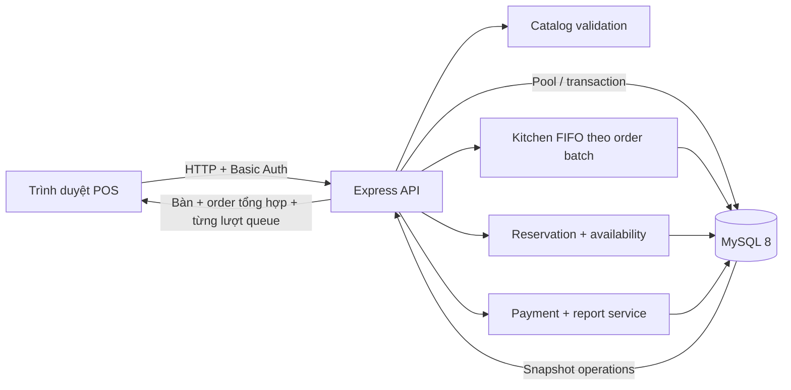
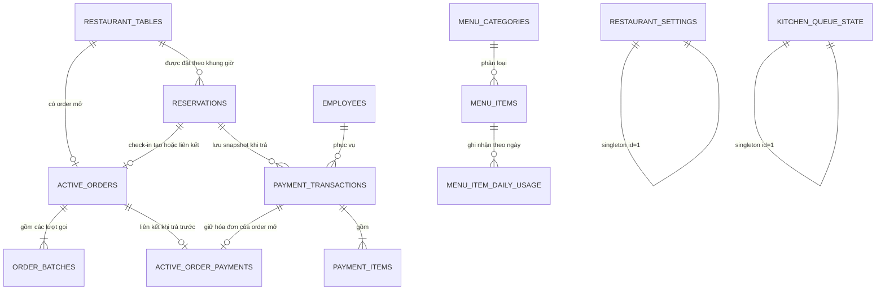

# Restaurant CASv2

Hệ thống POS và điều phối vận hành nhà hàng, gồm đặt bàn trước, gọi món/gọi thêm theo bàn, hàng đợi bếp FIFO theo từng lượt gọi, thanh toán tổng hợp, phiếu bếp 80 mm, hóa đơn A4, báo cáo Ngày–Tuần–Tháng và Dashboard quản trị. Dữ liệu nghiệp vụ được lưu tại MySQL; frontend không tự quyết định giá, tổng tiền, ETA hoặc tính hợp lệ của lịch đặt bàn cuối cùng.

## Tổng quan

| Thành phần | Công nghệ | Vai trò |
|---|---|---|
| Web | React 18, TypeScript, Vite | Đặt bàn, gọi món, bếp, thanh toán, báo cáo và quản trị |
| API | Node.js, Express | Xác thực, validation, transaction, đặt bàn và nghiệp vụ queue |
| Database | MySQL 8, InnoDB | Catalog, bàn, lịch đặt, order đang mở, cấu hình và giao dịch |
| Biểu đồ | Recharts, lazy-loaded | Báo cáo doanh thu và hóa đơn theo giờ/ngày/tuần |
| Giao diện | CSS responsive, Lucide | Desktop, tablet, mobile và bản in A4 |

Trạng thái hiện tại: chạy được end-to-end, `30/30` unit test, typecheck, production build, smoke test qua MySQL và `33/33` nhóm audit tính toàn vẹn database đều đạt. Migration tự chuyển order cũ thành lượt gọi số 1, bổ sung đặt bàn, nhân viên, danh mục lịch sử, sơ đồ bàn, hạn mức món theo ngày và vòng đời thanh toán trước mà không xóa dữ liệu. Cấu trúc phù hợp cho ứng dụng nội bộ hoặc MVP; phần [Đề xuất trước khi lên production](#đề-xuất-trước-khi-lên-production) liệt kê các bước còn cần khi mở rộng.

## Ảnh giao diện

### Đăng nhập và nhận diện thương hiệu


### Vận hành bàn và gọi món


### Sơ đồ mặt bằng theo khu vực


### Modal quản lý bàn trên mobile

<p align="center">
  
</p>

### ETA theo số lượng trên mobile

ETA của từng dòng hiển thị rõ công thức `thời gian món × số lượng`. Ảnh dưới minh họa `8 phút × 4 phần = khoảng 32 phút`.

<p align="center">
  
</p>

### Điều phối queue bếp và nhân viên


### Báo cáo vận hành

Ảnh dưới minh họa kỳ `Tháng`: trục hoành dùng các tuần lịch, tuần hiện tại chỉ tổng hợp đến ngày đang xem và các tuần tương lai không bị ghi nhận thành doanh thu `0`.


### Đặt bàn trước


<p align="center">
  
</p>

## Chức năng chính

- **Vận hành bàn** là màn làm việc duy nhất cho nhân viên: gộp chọn bàn, theo dõi trạng thái, tạo order, gọi thêm và mở modal thao tác; không còn hai mục Gọi món/Tổng quan trùng chức năng.
- Tìm bàn theo số bàn, khu vực hoặc tên khách đặt; lọc theo trạng thái, khu vực và **Đã trả**. Nhân viên có thể chuyển nhanh giữa lưới card và sơ đồ mặt bằng theo khu vực/tọa độ `X/Y`.
- Đặt bàn trước theo ngày, giờ, thời lượng, số khách và bàn; tra cứu bàn trống theo sức chứa, chặn trùng lịch ở cả giao diện lẫn transaction backend.
- Quản lý vòng đời đặt bàn `booked → seated → completed` hoặc `booked → cancelled/no_show`; check-in mở đúng bàn để gọi món và liên kết lịch đặt với order.
- Sửa riêng từng phiếu bếp còn `waiting`, giữ nguyên `batch_number`, `queued_at` và vị trí FIFO; phiếu đã nấu không bị ghi đè.
- Chỉ hủy order khi tất cả batch còn chờ; backend từ chối order đang nấu, đã xong hoặc mixed.
- Thực đơn và giá được backend đối chiếu lại từ MySQL để ngăn client giả dữ liệu.
- Mỗi món có thể đặt **số phần tối đa mỗi ngày** bằng `dailyLimit`: để trống là không giới hạn, `0` là hết món trong ngày. Màn quản trị hiển thị số đã nhận/còn lại; màn gọi món khóa món hết và giới hạn số lượng theo phần còn thực tế.
- Số phần được giữ trong transaction khi nhân viên **Gửi bếp**, sau khi gộp mọi size/topping của cùng một món. Sửa phiếu còn chờ chỉ cộng/trừ phần chênh lệch; hủy order toàn `waiting` hoàn lại số phần, còn món đã vào `cooking` hoặc `done` không được hoàn. Khi sang ngày kinh doanh mới theo `BUSINESS_TIME_ZONE`, hệ thống dùng bucket mới nên số còn lại tự trở về hạn mức mà không cần cron.
- ETA nấu được tính theo số lượng và lưu cùng order.
- Mỗi lượt gọi/gọi thêm tạo một `order_batch` độc lập và vào cuối queue FIFO.
- Lượt gọi thêm in thành phiếu bếp 80 mm riêng; khi thanh toán toàn bộ lượt được tổng hợp vào một hóa đơn A4.
- Thẻ bàn có chiều cao đồng đều và hiển thị số lượt gọi thêm, lượt đang nấu, đang chờ và đã xong; bàn trống vẫn giữ đủ cấu trúc để lưới không bị lệch.
- Mỗi trạng thái dùng đồng thời nhãn, icon và bảng màu riêng: chờ màu xanh lam, nấu màu cam, hoàn tất màu xanh lá và đặt trước màu tím; không phụ thuộc riêng vào màu sắc để truyền đạt thông tin.
- Queue bếp FIFO có giới hạn số lượt nấu song song.
- Chế độ bếp tự động, thủ công, tạm dừng và lấy phiếu tiếp theo; cấu hình dùng optimistic version để tránh hai máy POS ghi đè nhau.
- Timer chờ/nấu dựa trên timestamp UTC của server; frontend hiệu chỉnh độ lệch đồng hồ từ `serverNow` thay vì tin đồng hồ thiết bị. Khi đang nấu, thẻ hiển thị thời gian còn lại, thời gian đã chạy/ETA và thanh tiến trình có nhãn hỗ trợ trình đọc màn hình; khi vượt ETA sẽ đổi sang cảnh báo quá hạn.
- Bàn có món `done` hiển thị icon chuông và hiệu ứng nhắc nhẹ để nhân viên ưu tiên phục vụ; hiệu ứng tự tắt khi thiết bị bật `prefers-reduced-motion`.
- Đồng hồ backend tự chuyển batch đủ ETA sang `done` mỗi giây và cấp slot FIFO kế tiếp; pause không làm dừng món đang nấu.
- Cảnh báo riêng từng phiếu bếp sau khi vượt `ETA + khoảng gia hạn`, kèm thao tác xếp lại/hoàn tất đúng `batchId`.
- Thanh toán tiền mặt, thẻ hoặc QR; backend tính lại giảm giá, phí và VAT.
- Có hai luồng thanh toán song song: trả sau khi mọi batch đã `done` thì đóng order và giải phóng bàn ngay; trả trước khi còn món `waiting/cooking` thì vẫn giữ bàn, giữ queue bếp hoạt động và chờ nhân viên xác nhận khách đã rời sau khi món hoàn tất.
- Bàn trả trước hiển thị nhãn **Đã thanh toán**, thời điểm/mã hóa đơn; order bị khóa gọi thêm, sửa và hủy để hóa đơn không lệch với món đã thu tiền. Khi mọi batch đã `done`, nhân viên chọn **Xác nhận khách đã rời** để hoàn tất lịch đặt liên quan và đưa bàn về `empty`.
- Retry thanh toán dùng lại mã hóa đơn và được backend đối chiếu idempotent trước khi đọc active order.
- Hóa đơn A4 có kích thước cố định, không bị co cấu trúc trên màn hình nhỏ.
- Quản lý bàn, khu vực, món, danh mục, thời gian nấu, nhân viên/ca làm và cấu hình thương hiệu; vị trí bàn trong sơ đồ được hệ thống tự xếp vào ô trống. Màn Vận hành quản trị chia thành các tab Bếp, Thực đơn, Bàn và Nhân viên để không phải cuộn qua các khối không liên quan.
- Báo cáo Ngày–Tuần–Tháng từ hóa đơn đã trả: KPI, biểu đồ theo giờ/ngày/tuần, phương thức, món bán chạy, danh mục và hiệu suất nhân viên; có thể chọn trực tiếp ngày, tuần hoặc tháng lịch sử bất kỳ, chuyển kỳ trước/sau và quay về kỳ hiện tại.
- Browser Back/Forward khôi phục tab, modal bàn, tùy chỉnh món, giỏ hàng, bước chọn món/xác nhận và giữ giỏ hàng trong phiên.
- Polling có timeout 12 giây, dừng khi tab ẩn và hiển thị cảnh báo khi snapshot không còn đồng bộ.
- Top bar hiển thị tài khoản đang đăng nhập và có nút đăng xuất về màn hình sign-in.
- Giao diện responsive, hỗ trợ `prefers-reduced-motion`.

## Công thức ETA

Với mỗi dòng giỏ hàng:

```text
ETA dòng món = thời gian nấu một phần × số lượng
ETA order     = max(ETA của các dòng món)
```

Ví dụ:

```text
Phở bò: 12 phút × 3 = 36 phút
Gà nướng: 25 phút × 2 = 50 phút
ETA order = max(36, 50) = 50 phút
```

Công thức giả định các loại món khác nhau có thể được chế biến song song, nhưng nhiều phần giống nhau trên cùng một dòng cần thêm thời gian tuyến tính. Frontend chỉ hiển thị preview; backend tính lại ETA từ catalog MySQL và số lượng đã validation.

## Kiến trúc



Các nguyên tắc chính:

1. MySQL là nguồn sự thật; UI polling snapshot `/api/operations` mỗi 3 giây.
2. `active_orders` giữ giỏ hàng tổng hợp của bàn; `order_batches` giữ từng lượt gọi độc lập để điều phối và in phiếu bếp.
3. Những thao tác thay đổi order, queue hoặc payment đều khóa dữ liệu cần thiết bằng transaction InnoDB.
4. Queue được đồng bộ bằng khóa `kitchen_queue_state FOR UPDATE`, không phụ thuộc state trong RAM của một API instance.
5. Toàn bộ timestamp queue và đặt bàn được lưu, so sánh theo UTC; `/api/operations` trả thêm `serverNow` để UI hiệu chỉnh đồng hồ hiển thị.
6. Giá, tùy chọn món, tổng thanh toán và ETA đều được backend tính lại.
7. Lịch đặt bàn chống chồng lấn bằng validation, index và khóa transaction; lịch tương lai chỉ xuất hiện dưới dạng `nextReservation`, không chiếm bàn cả ngày.
8. `/api/operations` đọc bàn/order/batch/config/đặt bàn gần nhất trong một repeatable-read snapshot duy nhất.
9. Thanh toán trước được liên kết 1–1 với active order qua `active_order_payments`; hóa đơn đã chốt không thay đổi trong khi queue bếp tiếp tục hoàn tất các batch còn lại.
10. Hạn mức món được khóa theo cặp `(menu_item_id, business_date)` trong cùng transaction tạo/sửa/hủy order. Cách khóa theo thứ tự ngày và id ngăn hai máy POS cùng bán phần cuối; `/api/operations` đồng bộ phần còn lại giữa các thiết bị mà không phải tải lại toàn bộ catalog.

## Cấu trúc thư mục

```text
Restaurant_CASv2/
├─ apps/
│  ├─ api/
│  │  ├─ src/
│  │  │  ├─ server.js            # HTTP, auth, endpoint và transaction orchestration
│  │  │  ├─ db.js                # Pool, bootstrap schema và migration tương thích
│  │  │  ├─ domain.js            # Validation order/settings và công thức payment
│  │  │  ├─ catalog.js           # Catalog, canonicalization và ETA
│  │  │  ├─ dailyInventory.js     # Hạn mức món theo ngày, giữ/hoàn số phần trong transaction
│  │  │  ├─ kitchenQueue.js      # Điều phối FIFO có khóa database
│  │  │  ├─ reservation.js       # Chuẩn hóa, overlap và vòng đời đặt bàn
│  │  │  ├─ orderPolicy.js       # Quy tắc hủy order và thanh toán theo batch
│  │  │  └─ defaultSettings.js
│  │  ├─ scripts/
│  │  │  ├─ smoke.mjs            # Smoke test qua API + MySQL thật
│  │  │  ├─ seed-test-data.mjs   # Dữ liệu demo idempotent, không xóa dữ liệu thật
│  │  │  └─ audit-db.mjs         # Audit toàn vẹn 33 nhóm ở chế độ READ ONLY
│  │  └─ test/                    # Unit test nghiệp vụ
│  └─ web/
│     ├─ public/brand/            # Asset được Vite phục vụ trực tiếp
│     └─ src/
│        ├─ app/App.tsx           # Điều phối state, polling và navigation
│        ├─ app/data.ts           # Type, seed catalog và helper giỏ hàng
│        ├─ app/reporting.ts      # Dựng timeline giờ/ngày/tuần và báo cáo nhân viên
│        ├─ app/services/api.ts   # HTTP client có auth, timeout và chuẩn hóa lỗi
│        ├─ app/config/           # Brand/settings dùng chung
│        ├─ app/components/       # Màn hình nghiệp vụ
│        │  └─ ReservationsPage.tsx # Quản lý lịch đặt bàn và check-in
│        └─ styles/                # Theme, responsive và hiệu ứng
├─ database/schema.sql            # Schema bootstrap thủ công
├─ docs/screenshots/              # Ảnh thật dùng trong README
├─ assets/brand/                   # Asset thương hiệu gốc/chất lượng nguồn
├─ assets/invoice-template-source/ # Bản nguồn tham khảo của mẫu hóa đơn
├─ package.json                    # npm workspaces
└─ README.md
```

### Đánh giá tên file và bố cục

- `apps/api` và `apps/web` tách đúng ranh giới backend/frontend.
- `catalog.js`, `domain.js`, `kitchenQueue.js` thể hiện đúng trách nhiệm nghiệp vụ.
- Module demo cũ `dashboardData.ts` đã được thay bằng `reporting.ts` đúng nội dung thực tế.
- 48 component shadcn sinh sẵn nhưng không được import đã được loại bỏ cùng dependency thừa.
- `assets/brand` là bản nguồn; `apps/web/public/brand` là bản được phục vụ runtime. Việc trùng này có chủ đích.
- `App.tsx`, `MenuStep.tsx` và `DashboardPage.tsx` vẫn khá lớn do nhiều inline style. Nên tách thêm khi dự án tiếp tục phát triển, nhưng chưa cần đổi tên/di chuyển ngay vì luồng hiện tại rõ và ổn định.

## Yêu cầu môi trường

- Node.js `>= 20.19`
- npm `>= 10`
- MySQL `8.x`
- Windows, macOS hoặc Linux

## Cài đặt

Tại thư mục gốc:

```powershell
npm install
Copy-Item apps/api/.env.example apps/api/.env
Copy-Item apps/web/.env.example apps/web/.env
```

Chỉnh `apps/api/.env` trước khi chạy. Không commit `.env`.

### Biến môi trường API

| Biến | Mặc định mẫu | Ý nghĩa |
|---|---:|---|
| `PORT` | `4100` | Cổng API |
| `HOST` | `0.0.0.0` | Cho phép máy khác trong LAN kết nối |
| `CORS_ORIGIN` | `http://localhost:5173` | Allowlist origin production, phân cách bằng dấu phẩy |
| `CORS_ALLOW_PRIVATE_NETWORK` | `true` | Chỉ development: cho localhost/IPv6/IP LAN riêng |
| `AUTH_USERNAME` | `admin` | Tài khoản POS |
| `AUTH_PASSWORD` | bắt buộc đổi | Mật khẩu dài và ngẫu nhiên |
| `KITCHEN_CONCURRENCY` | `2` | Công suất bếp khởi tạo |
| `KITCHEN_STALE_MINUTES` | `120` | Khoảng gia hạn sau ETA trước khi cảnh báo batch quá hạn |
| `BUSINESS_TIME_ZONE` | `Asia/Ho_Chi_Minh` | Múi giờ xác định ngày kinh doanh và thời điểm đặt lại số phần món |
| `DB_HOST` | `127.0.0.1` | Máy chủ MySQL |
| `DB_PORT` | `3306` | Cổng MySQL |
| `DB_USER` | `root` | User MySQL local |
| `DB_PASSWORD` | bắt buộc đổi | Mật khẩu MySQL |
| `DB_NAME` | `restaurant_casv2` | Tên database |
| `DB_AUTO_MIGRATE` | `true` | Tự bootstrap/migrate khi phát triển |
| `DB_CONNECTION_LIMIT` | `10` | Số connection tối đa trong pool |
| `DB_QUEUE_LIMIT` | `100` | Số request chờ connection |
| `LEGACY_TIMEZONE_OFFSET_MINUTES` | `420` | Chỉ dùng một lần khi đổi timestamp legacy sang UTC |

Đặt cùng một `BUSINESS_TIME_ZONE` cho mọi API instance của nhà hàng. Ngày kinh doanh được tính ở backend theo biến này, không theo múi giờ của máy POS hoặc MySQL session; mỗi ngày có một dòng usage riêng nên không cần tiến trình reset chạy lúc nửa đêm.

### Biến môi trường web

| Biến | Giá trị | Ý nghĩa |
|---|---|---|
| `VITE_API_BASE_URL` | để trống | Dùng `/api` cùng domain hoặc Vite proxy |
| `VITE_DEV_API_TARGET` | `http://127.0.0.1:4100` | Đích proxy khi chạy dev |

## Database và migration

Chạy migration chủ động:

```powershell
npm run db:migrate
```

Hoặc chạy schema bằng MySQL CLI:

```powershell
npm run db:schema
```

`db:schema` hỏi mật khẩu tương tác và không đặt mật khẩu trên command line.

### Nạp dữ liệu đầy đủ để test

```powershell
npm run db:seed:test
```

Script chỉ làm mới dữ liệu sở hữu bởi tiền tố `demo-`, vì vậy không xóa bàn, order hay hóa đơn thật. Có thể chạy lại nhiều lần để đưa dữ liệu mẫu về trạng thái ban đầu.

| Dữ liệu mẫu | Nội dung |
|---|---|
| Bàn `101–108` | Bàn trống và bàn có order ở nhiều trạng thái; lịch đặt được lưu riêng, không giả lập bằng trạng thái bàn |
| Đặt bàn | Lịch demo đủ các trạng thái `booked`, `seated`, `completed`, `cancelled`, `no_show`, gồm lịch sắp tới để test `nextReservation` |
| Order | 5 order đang mở, 7 batch, gồm 2 bàn có lượt gọi thêm |
| Queue | ETA tính từ `cookMinutes × quantity`, gồm batch chờ, đã xong và lượt gọi thêm |
| Thanh toán | 6 hóa đơn gần thời điểm hiện tại, đủ tiền mặt, thẻ và QR |
| Nhân viên | 3 nhân viên phục vụ demo theo các ca khác nhau; hóa đơn được gán nhân viên |
| Catalog | Nhóm `Món demo số lượng` có 8 món không giới hạn cho các luồng order, một món giới hạn 20 phần/còn 6 và một món giới hạn 8 phần/đã hết để kiểm thử UI còn hàng–hết hàng |

### Quan hệ dữ liệu



| Bảng | Vai trò | Ràng buộc/index đáng chú ý |
|---|---|---|
| `restaurant_tables` | Số bàn, ghế, trạng thái, khu vực và tọa độ `X/Y` dùng dựng sơ đồ mặt bằng | PK `id`, unique `table_number`, index `status`; `X/Y` cùng để trống hoặc trong `1..24`, unique `(area, position_x, position_y)` chống hai bàn trùng ô |
| `reservations` | Khách, điện thoại chuẩn hóa, số khách, bàn, thời điểm bắt đầu/kết thúc và vòng đời đặt bàn | FK bàn, unique `seated_table_id` bảo đảm tối đa một lịch đang nhận khách/bàn, CHECK thời lượng/vòng đời, `version` optimistic và index lịch |
| `active_orders` | Giỏ hàng tổng hợp đang mở của mỗi bàn, dùng khi thanh toán | unique `table_id`, optional unique `reservation_id`, FK bàn/đặt bàn; xóa order sẽ cascade các batch |
| `order_batches` | Từng lượt gọi/gọi thêm và trạng thái bếp riêng | unique `(order_id, batch_number)`, index FIFO `(status, queued_at, id)`; `inventory_date` cố định bucket ngày đã giữ số phần |
| `kitchen_queue_state` | Công suất/chế độ queue và phiên bản cấu hình | Một hàng `id=1`, `version` optimistic, khóa bằng `FOR UPDATE` |
| `menu_categories` | Danh mục món | PK `id`, thứ tự và trạng thái active |
| `menu_items` | Giá, ETA, size, topping và hạn mức số phần/ngày | FK category, index category/available; `daily_limit` nullable, `NULL` nghĩa là không giới hạn |
| `menu_item_daily_usage` | Số phần đã giữ của từng món theo ngày kinh doanh | PK `(menu_item_id, business_date)`, FK món `ON DELETE CASCADE`, index `(business_date, menu_item_id)` |
| `restaurant_settings` | Thương hiệu và hóa đơn | JSON, một hàng `id=1` |
| `employees` | Hồ sơ, vai trò, số điện thoại và ca làm | unique `employee_code`, soft deactivate |
| `payment_transactions` | Header hóa đơn đã trả, snapshot nhân viên/khách và trạng thái phục vụ sau thanh toán | unique `invoice_code`, `service_status` chỉ nhận `awaiting_departure/closed`, `departure_confirmed_at`, optional FK đặt bàn, index `paid_at/staff_id` và `(service_status, table_id)` |
| `active_order_payments` | Liên kết tạm hóa đơn trả trước với order vẫn đang phục vụ | PK/FK `order_id`, unique/FK `transaction_id`; một order và một hóa đơn chỉ có tối đa một liên kết |
| `payment_items` | Chi tiết món và snapshot danh mục đã thanh toán | FK transaction, index category, `ON DELETE CASCADE` |
| `schema_migrations` | Đánh dấu migration dữ liệu | PK migration id |

Chạy `npm run db:audit` ngày 21/07/2026 cho kết quả `33/33` nhóm kiểm tra đạt ở chế độ `READ ONLY`. Audit bao phủ FK/mồ côi, unique order theo bàn, JSON và số tiền hóa đơn, số lượng item, trạng thái bàn so với batch, thứ tự/ETA queue, singleton cấu hình, phiên bản bếp, quan hệ đặt bàn–order–payment, vòng đời trả trước/`awaiting_departure`, liên kết 1–1 `active_order_payments`, hạn mức/ledger món theo ngày, ngày tồn kho của batch, cấu trúc và tính duy nhất của vị trí sơ đồ, sức chứa, khoảng thời gian, số điện thoại chuẩn hóa và các lịch active chồng lấn. Script chỉ đọc và trả mã lỗi khác `0` nếu phát hiện vi phạm.

## Chạy development

Mở hai terminal:

```powershell
npm run dev:api
```

```powershell
npm run dev:web
```

- Web: `http://localhost:5173`
- API health: `http://127.0.0.1:4100/api/health`

## Dùng trên điện thoại hoặc máy khác trong Wi-Fi

1. Chạy API và web như trên.
2. Dùng `ipconfig` để lấy IPv4 của máy chạy dự án.
3. Mở `http://<IPv4>:5173` trên thiết bị khác.
4. Cho phép Node.js qua Windows Firewall ở mạng Private nếu được hỏi.

Development cho phép `localhost`, `127.x`, IPv6 loopback, `10.x`, `192.168.x` và `172.16-31.x` khi `CORS_ALLOW_PRIVATE_NETWORK=true`. Production luôn yêu cầu origin nằm chính xác trong `CORS_ORIGIN`.

## Luồng nghiệp vụ

### Gọi món và queue bếp

1. Nhân viên tìm/lọc bàn trên màn **Vận hành bàn**, dùng lưới hoặc sơ đồ theo khu vực rồi mở cùng một modal thao tác. Client gửi danh sách món và số lượng; `append=false` tạo lượt đầu, `append=true` tạo lượt gọi thêm.
2. Backend validation giới hạn 1–100 dòng, mỗi dòng 1–99 phần.
3. Backend tải lại catalog theo id, thay toàn bộ giá/size/topping client bằng dữ liệu MySQL.
4. Trong cùng transaction gửi bếp, backend gộp số lượng theo `menuItem.id`, khóa bucket của ngày kinh doanh hiện tại và giữ số phần. Nếu không đủ, toàn bộ request rollback với `409 MENU_ITEM_DAILY_LIMIT_EXCEEDED`; hai máy POS không thể cùng nhận phần cuối.
5. Backend tính `ETA dòng = cookMinutes × quantity` và lấy dòng lâu nhất.
6. Backend nối món vào `active_orders` để giữ tổng bill và tạo một dòng `order_batches` chỉ chứa món của lượt mới; batch lưu `inventory_date` để mọi lần điều chỉnh dùng đúng bucket ngày.
7. Phiếu bếp của lượt mới có thể in riêng; batch được xếp cuối queue bằng `queued_at, id`.
8. Queue khóa `kitchen_queue_state`, đếm slot trống và lấy batch FIFO.
9. Batch được lấy chuyển `waiting → cooking` và ghi `cooking_started_at`; trạng thái bàn được suy ra từ tất cả batch của bàn.
10. Mỗi giây backend so sánh `cooking_started_at + estimated_cook_minutes` với thời gian UTC MySQL. Batch đủ ETA tự chuyển `cooking → done`.
11. Queue tự lấy batch FIFO tiếp theo nếu đang ở chế độ tự động. Bàn chỉ `done` khi không còn batch chờ/nấu; khi pause/manual, món hiện tại vẫn hoàn tất nhưng không tự lấy món mới.
12. Khi sửa, client gửi đúng `batchId`; transaction chỉ chấp nhận batch vẫn `waiting`, canonicalize lại món/ETA, điều chỉnh số phần theo chênh lệch và rebuild giỏ tổng từ toàn bộ batch. Nếu phiếu chờ được sửa sau khi đã sang ngày mới, phần cũ được trả về bucket cũ và nội dung mới được giữ ở bucket ngày hiện tại.
13. Hủy order chỉ hợp lệ khi tất cả batch còn `waiting`; transaction hoàn lại số phần đã giữ theo `inventory_date`. Batch đã `cooking` hoặc `done` không được hoàn hạn mức.
14. Trạng thái order không được ép qua CRUD bàn; mọi chuyển trạng thái phải đi qua action queue để không vượt công suất bếp.
15. Hoàn tất/đưa lại hàng chờ phải gửi đúng `expectedBatchId`; retry, bấm kép hoặc client dùng snapshot cũ không thể tác động nhầm phiếu kế tiếp.
16. Cấu hình bếp được cập nhật từng phần bằng `PATCH` kèm `expectedVersion`; backend khóa singleton và trả `409` nếu máy POS đang dùng phiên bản cũ, tránh ghi đè công suất/chế độ vừa được máy khác thay đổi.
17. Mỗi snapshot trả `serverNow`; frontend ước lượng độ lệch theo điểm giữa thời gian gửi–nhận request và dùng đồng hồ server đã hiệu chỉnh cho timer. Batch chỉ bị cảnh báo stale sau `ETA + KITCHEN_STALE_MINUTES`, không cảnh báo ngay khi vừa hết ETA.

### Đặt bàn trước

1. Nhân viên nhập tên, điện thoại, số khách, ngày/giờ, thời lượng 30–480 phút, bàn và ghi chú; giao diện chỉ đề xuất bàn đủ sức chứa và còn trống trong toàn bộ khoảng thời gian.
2. `POST /api/reservations` chuẩn hóa điện thoại, tính `ends_at` và kiểm tra overlap trong transaction. Hai máy đặt cùng một bàn/khung giờ đồng thời không thể cùng thành công.
3. Chỉ lịch `booked` được sửa; client gửi `expectedVersion`, vì vậy bản ghi cũ nhận `409` thay vì ghi đè thay đổi mới hơn.
4. Vòng đời hợp lệ là `booked → seated → completed` hoặc `booked → cancelled/no_show`. Check-in được phép sớm tối đa 60 phút; đánh dấu `no_show` sau 15 phút kể từ giờ hẹn.
5. Check-in chuyển lịch sang `seated`, mở đúng bàn để gọi món và liên kết `reservation_id` với active order. Không thể hoàn tất lịch `seated` khi bàn vẫn còn order mở.
6. Thanh toán luôn lưu snapshot mã đặt bàn, tên khách và số khách vào hóa đơn. Nếu trả sau khi món đã xong, lịch `seated` hoàn tất ngay; nếu trả trước, lịch vẫn giữ `seated` cho đến khi món xong và nhân viên xác nhận khách đã rời.
7. Lịch tương lai chỉ hiển thị trên thẻ bàn bằng `nextReservation`. Bàn chỉ được giữ khi khách đã `seated` hoặc lịch `booked` còn không quá 15 phút; lịch buổi tối không khóa bàn từ đầu ngày.

### Thanh toán

1. Client bật thanh toán cho mọi bàn có active order chưa trả tiền, kể cả khi batch còn `waiting` hoặc `cooking`; nhân viên chọn người phục vụ và client giữ ổn định mã idempotency trong mọi lần retry.
2. Backend kiểm tra giao dịch cùng mã đã tồn tại trước khi yêu cầu active order; retry sau timeout nhận lại kết quả cũ.
3. Backend khóa bàn/order/batch, từ chối order đã có hóa đơn và xác định có cần giữ bàn hay không. Cờ `payment.keepTableOpen` giữ nguyên ý định trả trước nếu bếp vừa hoàn tất trong lúc màn thanh toán đang mở.
4. Backend xác thực nhân viên còn hoạt động đúng vai trò Phục vụ, đọc settings và tính subtotal, discount, service fee, VAT, total.
5. Tất cả món từ mọi lượt gọi được ghi vào cùng header; item lưu snapshot danh mục để báo cáo lịch sử không đổi theo catalog. Nếu order đến từ đặt bàn, header đồng thời lưu snapshot khách và lịch đặt.
6. **Trả sau:** nếu mọi batch đã `done` và không yêu cầu giữ bàn, giao dịch nhận `service_status=closed`; active order bị xóa, lịch `seated` liên quan chuyển `completed` và bàn về `empty` trong cùng transaction. Đây là luồng cũ và vẫn được giữ nguyên.
7. **Trả trước:** khi còn batch `waiting/cooking`, hoặc client đã mở luồng trả trước với `keepTableOpen=true`, giao dịch nhận `service_status=awaiting_departure` và được liên kết với active order trong `active_order_payments`. Bàn tiếp tục ở trạng thái bếp thực tế, queue vẫn chạy, UI hiển thị **Đã thanh toán** và backend khóa gọi thêm, sửa hoặc hủy order.
8. Khi tất cả batch của bàn trả trước đã `done`, nhân viên gọi `POST /api/orders/:tableId/confirm-departure`. Backend xác thực trạng thái, đổi giao dịch sang `closed`, ghi `departure_confirmed_at`, hoàn tất lịch `seated`, xóa active order và đưa bàn về `empty`. Gọi lại endpoint an toàn theo cơ chế idempotent.
9. Response thanh toán trả `requiresDepartureConfirmation` và `orderClosed` để UI phân biệt hai nhánh. Chỉ sau khi transaction thanh toán commit thành công frontend mới cho in hóa đơn A4 tổng hợp.

### Báo cáo

| Kỳ | Khoảng dữ liệu | Trục hoành | Ví dụ nhãn |
|---|---|---|---|
| `Ngày` | 00:00–24:00 của ngày được chọn | 24 giờ | `00h`, `08h`, `16h`, `23h` |
| `Tuần` | Thứ Hai–Chủ nhật của tuần được chọn | 7 ngày | `T2 13/07`, `T3 14/07`, … |
| `Tháng` | Ngày đầu–cuối tháng được chọn | 4–6 tuần lịch, cắt đúng biên tháng | `01–05/07`, `06–12/07`, … |

- Người dùng chọn `Ngày`, `Tuần` hoặc `Tháng`, sau đó chọn trực tiếp một ngày/tuần/tháng lịch sử bất kỳ; các nút kỳ trước, kỳ sau và kỳ hiện tại hỗ trợ tra cứu nhanh. Tiêu đề luôn hiển thị rõ ngày đơn, khoảng đầu–cuối tuần hoặc tháng đang được tổng hợp.
- Mỗi lựa chọn gửi đúng biên `from/to` của kỳ đang chọn tới API, không phụ thuộc ngày hiện tại.
- Bucket tương lai để trống thay vì ghi `0`; tooltip luôn hiển thị đầy đủ giờ/ngày hoặc khoảng tuần và tên chỉ số tiếng Việt.
- Frontend gửi biên ngày địa phương dưới dạng UTC và `timezoneOffsetMinutes` để bucket giờ/ngày đúng múi giờ thiết bị POS.
- API trả đồng thời `hourly[]` và `daily[]` được aggregate trực tiếp từ `payment_transactions`; frontend zero-fill các mốc đã qua và gom `daily[]` thành tuần lịch cho kỳ Tháng.
- Tổng doanh thu/số hóa đơn của `daily[]` được smoke test đối chiếu với KPI; báo cáo không phụ thuộc danh sách payment giới hạn hoặc order đang mở.
- Danh mục/món dùng snapshot đã thanh toán; doanh thu nhân viên dùng header hóa đơn và `staff_id`.
- Biểu đồ Recharts chỉ được tải khi người dùng mở trang Báo cáo.
- Kỳ lịch sử đang xem được giữ nguyên khi trang mở xuyên nửa đêm; hệ thống không tự nhảy về hiện tại và làm mất ngữ cảnh tra cứu của nhân viên.

## API chính

Mọi endpoint `/api/*`, trừ health, đều yêu cầu xác thực khi auth được cấu hình.

| Method | Endpoint | Chức năng |
|---|---|---|
| `GET` | `/api/health` | Kiểm tra API/MySQL |
| `GET` | `/api/auth/session` | Kiểm tra phiên Basic Auth |
| `GET/PUT` | `/api/settings` | Đọc/lưu cấu hình nhà hàng |
| `GET/POST/PUT/DELETE` | `/api/employees` | Danh sách, tạo, sửa và ngừng hoạt động nhân viên |
| `GET` | `/api/reservations?from=&to=&status=&q=&tableId=` | Tìm/lọc lịch đặt bàn trong khoảng thời gian |
| `GET` | `/api/reservations/availability?reservedAt=&durationMinutes=&partySize=` | Tìm bàn đủ sức chứa và không chồng lịch |
| `POST` | `/api/reservations` | Tạo lịch `booked` sau khi khóa và kiểm tra overlap |
| `PUT` | `/api/reservations/:reservationId` | Sửa lịch còn `booked` với `expectedVersion` |
| `PATCH` | `/api/reservations/:reservationId/status` | Check-in, hoàn tất, hủy hoặc đánh dấu vắng mặt theo vòng đời hợp lệ |
| `GET` | `/api/catalog` | Lấy danh mục/món; mỗi món trả `dailyLimit`, `dailyUsed`, `dailyRemaining` và `inventoryDate` của ngày kinh doanh hiện tại |
| `POST` | `/api/catalog/bootstrap` | Seed catalog nếu database trống |
| `POST/PUT/DELETE` | `/api/categories` | Quản lý danh mục |
| `POST/PUT/DELETE` | `/api/menu-items` | Quản lý món/ngừng bán và cấu hình `dailyLimit` (`null` = không giới hạn, `0..1000000` = hạn mức/ngày) |
| `GET` | `/api/operations` | Snapshot nhất quán gồm `serverNow`, bàn/`nextReservation`, order, batch, cấu hình bếp, trạng thái thanh toán và `menuAvailability[]` để đồng bộ `dailyUsed/dailyRemaining` giữa các máy POS |
| `PUT` | `/api/orders/:tableId` | Tạo lượt đầu hoặc gọi thêm với body `{ items, append }`; giữ số phần theo ngày trong transaction |
| `PUT` | `/api/orders/:tableId/batches/:batchId` | Sửa đúng một phiếu bếp còn chờ, không đổi FIFO và cập nhật chênh lệch số phần |
| `POST` | `/api/orders/:tableId/requeue` | Đưa đúng `expectedBatchId` đang nấu về cuối queue |
| `DELETE` | `/api/orders/:tableId` | Hủy khi toàn bộ batch của order còn chờ và hoàn số phần theo bucket ngày của từng batch |
| `POST` | `/api/orders/:tableId/confirm-departure` | Xác nhận khách của order trả trước đã rời sau khi mọi batch `done`; đóng giao dịch/lịch đặt và giải phóng bàn, hỗ trợ retry idempotent |
| `PATCH` | `/api/kitchen/config` | Cập nhật một phần công suất/chế độ/pause với `expectedVersion` |
| `POST` | `/api/kitchen/dispatch-next` | Lấy một order đầu queue |
| `POST/PUT/DELETE` | `/api/tables` | Quản lý số bàn, ghế, khu vực và tọa độ `positionX/positionY`; trùng ô trong cùng khu vực trả `409 TABLE_POSITION_OCCUPIED` |
| `PATCH` | `/api/tables/:tableId/status` | Hoàn tất đúng `expectedBatchId` đang nấu; chống bấm lặp/client stale |
| `GET` | `/api/payments?from=&to=` | Giao dịch trong khoảng thời gian |
| `POST` | `/api/payments` | Thanh toán active order ở trạng thái chờ/nấu/đã xong; hỗ trợ `payment.keepTableOpen`, idempotent theo invoice và trả `requiresDepartureConfirmation`, `orderClosed` |
| `GET` | `/api/reports/summary?from=&to=&timezoneOffsetMinutes=` | Aggregate KPI, `hourly[]`, `daily[]`, phương thức, món, danh mục và nhân viên |

## Scripts

| Lệnh | Tác dụng |
|---|---|
| `npm run dev:api` | API với Node watch mode |
| `npm run dev:web` | Vite dev server trên `0.0.0.0` |
| `npm run db:migrate` | Bootstrap/migrate MySQL |
| `npm run db:seed:test` | Làm mới bộ bàn/đặt bàn/order/batch/payment demo |
| `npm run db:audit` | Kiểm tra 33 nhóm ràng buộc và toàn vẹn ở chế độ READ ONLY |
| `npm run typecheck` | TypeScript strict check |
| `npm test` | Unit test backend |
| `npm run test:smoke` | Test end-to-end qua API/MySQL |
| `npm run build` | Build frontend production |
| `npm run check` | Typecheck + unit test + build |
| `npm audit --audit-level=high` | Audit dependency |

## Kiểm thử và chất lượng

```powershell
npm run typecheck
npm test
npm run db:audit
npm run test:smoke
npm run build
npm audit --audit-level=high
```

Phạm vi unit test hiện tại:

- `30/30` test nghiệp vụ đang đạt.
- Canonicalization catalog và chống giả giá/topping.
- Validation category, menu, quantity, VAT và thời gian nấu.
- Hạn mức món theo ngày: xác định ngày kinh doanh, gộp số lượng cùng món, giữ đúng phần cuối, từ chối vượt mức, điều chỉnh khi sửa phiếu chờ và hoàn khi hủy.
- ETA theo số lượng và lấy dòng lâu nhất.
- Queue batch đủ slot, pause, manual và automatic.
- Tự hoàn tất tất cả batch chạy đủ ETA và đồng bộ lại trạng thái bàn.
- Cảnh báo batch stale chỉ sau ETA cộng khoảng gia hạn cấu hình.
- Công thức payment và thời gian server.
- Validation nhân viên, vai trò, ca làm và mã nhân viên.
- Chuẩn hóa lịch đặt bàn, số điện thoại, thời lượng, sức chứa, phát hiện overlap và các chuyển trạng thái hợp lệ/không hợp lệ.
- Policy chỉ hủy order toàn-waiting; xác định đúng khi nào thanh toán cần giữ bàn, gồm trường hợp `keepTableOpen=true` trong lúc bếp vừa chuyển từ đang nấu sang đã xong.

Smoke test pause bếp có khôi phục cấu hình, từ chối `expectedVersion` bếp cũ, tạo bàn tạm, kiểm tra đặt bàn trùng giờ và hai request đồng thời, chặn check-in khi bàn còn lịch `seated`, đối chiếu tổng bucket báo cáo theo ngày với KPI, kiểm tra ETA theo số lượng, sửa phiếu chờ vẫn giữ FIFO và chặn thao tác bằng `batchId` cũ. Hạn mức món được kiểm tra qua chuỗi giữ 2 phần, cho hai request đồng thời giành phần cuối nhưng chỉ một request thành công, sửa thành 3, chặn gọi vượt mức bằng `409`, rồi hủy phiếu chờ và hoàn đủ số lượng. Luồng thanh toán được kiểm tra ở cả hai nhánh: trả trước vẫn giữ bàn/queue, khóa sửa–gọi thêm–hủy, hiện nhãn đã trả và chỉ giải phóng bàn sau `confirm-departure`; trả sau khi toàn bộ batch đã xong đóng bàn ngay.

## Hiệu năng

Production bundle được build lại ngày 20/07/2026. Các số runtime là mốc đo tham khảo trên máy phát triển, chưa được dùng làm SLA production:

| Chỉ số | Kết quả |
|---|---:|
| Main JS trước tối ưu | 255,18 KB / 72,86 KB gzip |
| Main JS hiện tại sau lazy-load | 217,20 KB / 67,89 KB gzip |
| Chunk biểu đồ (chỉ tải khi mở Báo cáo) | 395,07 KB / 108,86 KB gzip |
| Main CSS trước dọn UI thừa | 104,58 KB / 18,55 KB gzip |
| CSS dùng chung hiện tại | 56,90 KB / 12,03 KB gzip |
| Chunk Đặt bàn JS | 21,23 KB / 6,73 KB gzip |
| Chunk Đặt bàn CSS | 11,84 KB / 2,84 KB gzip |
| Chunk Thanh toán CSS | 5,85 KB / 1,65 KB gzip |
| Transfer/FCP/JS heap màn login | cần đo lại bằng Lighthouse trên bản deploy đích |
| API process working set | khoảng 72 MB |
| `/api/operations` payload gồm editable waiting batch | khoảng 9,97 KB |
| `/api/operations` p50 / p95, 30 mẫu | 1,79 ms / 3,70 ms |
| `/api/catalog` payload | khoảng 7,7 KB |
| `/api/catalog` p50 / p95, 30 mẫu | 1,00 ms / 1,36 ms |
| `/api/reports/summary` payload / p50 / p95 | 1,53 KB / 5,36 ms / 6,78 ms (30 mẫu) |

Các tối ưu đã áp dụng:

- Lazy-load Menu, Xác nhận, Thành công, Đặt bàn, Thanh toán, Dashboard và biểu đồ; màn Tổng quan trùng lặp đã được loại khỏi điều hướng.
- Recharts nằm ở chunk riêng và chỉ tải khi mở Báo cáo.
- Ảnh menu ngoài viewport dùng `loading="lazy"` và `decoding="async"`.
- Polling không chạy khi tab trình duyệt bị ẩn và không cho request chồng nhau.
- Mọi thẻ bàn dùng chung một nhịp đồng hồ mỗi giây; backend có guard chống chạy chồng và khóa hàng cấu hình MySQL khi điều phối.
- Xóa 48 component UI không dùng và 151 package đã cài thừa.
- Snapshot operations dùng một repeatable-read transaction; query FIFO và báo cáo aggregate dùng index phù hợp.
- HTTP client timeout sau 12 giây và top bar cảnh báo snapshot cũ thay vì im lặng khi mất backend.
- Giới hạn JSON body `256 KB`, payment list theo ngày tối đa 1.000 bản ghi.

Vite development dùng nhiều RAM hơn build production do HMR, source map và module graph; không nên dùng mức RAM của `npm run dev:web` để đánh giá server production.

## Đánh giá giao diện

Shell ứng dụng dùng toàn bộ `100vw`, không còn giới hạn `max-width: 1440px` gây hai dải trống trên màn hình rộng. Giao diện đã được đo bằng Chrome ở 320, 390, 768, 861, 1024 và 1366 px; riêng màn Đặt bàn được kiểm tra thực tế ở 390 × 844 và 1366 × 800, không tràn ngang và không có touch target nhỏ. Login chuyển một cột từ 920 px, modal mobile phủ đủ `100dvh`, form quản trị wrap theo màn hình và không còn tràn ngang đã biết. Top bar chỉ dùng một logo ngang CAS lớn; màu thương hiệu/nền quản trị đủ phân tách; bottom navigation chuyển thành sidebar trên màn hình lớn.

Các nguyên tắc đã có:

- Touch target thao tác chính và nút biểu tượng tối thiểu 44 px.
- Grid dùng `auto-fill/minmax` cho bàn và món.
- Navigation desktop/mobile khác bố cục nhưng cùng chức năng; Gọi món và Tổng quan đã được gộp thành một mục **Vận hành bàn**.
- Màn Vận hành bàn có tìm kiếm theo số/khu vực/khách, bộ lọc trạng thái/khu vực/đã trả và chuyển đổi **Lưới – Sơ đồ**. Sơ đồ nhóm bàn theo khu vực; hệ thống tự cấp vị trí trống khi thêm bàn hoặc đổi khu vực và vẫn cho phép cuộn khi mặt bằng rộng.
- Trường khu vực trong Quản trị là combobox: luôn mở được toàn bộ khu vực đã lưu để chọn lại, đồng thời vẫn nhận tên mới nhập trực tiếp.
- Card bàn dùng chiều cao thống nhất; trạng thái có cả chữ, icon và màu phân biệt rõ. Đồng hồ nấu hiển thị thời gian còn lại cùng thanh tiến trình; bàn đã xong có chuông và nhắc nhẹ để ưu tiên phục vụ.
- Màn Vận hành có thanh chuyển phần Bếp/Thực đơn/Bàn/Nhân viên bám theo viewport và chỉ render khối đang chọn; chỉnh món không còn nằm dưới toàn bộ cấu hình bếp và danh sách bàn.
- Báo cáo có bộ chọn Ngày/Tuần/Tháng lịch sử tùy ý, nút kỳ trước/sau/hiện tại, trục giờ/ngày/tuần tương ứng, tooltip đầy đủ, nhãn khoảng ngày và lưới KPI tự co theo chiều rộng.
- Thẻ bàn phân tách trạng thái bếp với trạng thái tiền: nhãn **Đã thanh toán** vẫn hiện khi món đang chờ/nấu; khi món xong, hành động xác nhận khách rời được đặt ngay trong modal bàn.
- Hiệu ứng được tắt gần như hoàn toàn khi người dùng bật reduced motion.
- Animation xuất hiện khi mở giao diện đăng nhập và ở cảnh báo nhẹ cho bàn có món đã xong; button không có hiệu ứng pulse/scale khi bấm.
- Modal quản lý bàn, đặt bàn, tùy chỉnh món, giỏ hàng, thanh toán và xác nhận nguy hiểm được render bằng portal trực tiếp vào `body`, phủ đủ viewport, khóa focus và cuộn nội dung bên trong nên không bị đứt overlay ở màn hình thấp.
- Hóa đơn giữ kích thước A4 và cho phép cuộn ngang ở viewport hẹp.
- Phiếu gọi món/gọi thêm có vùng in riêng rộng 80 mm; hóa đơn thanh toán vẫn là bản tổng hợp A4 cố định.

Hiệu chuẩn nên làm tiếp trên thiết bị POS thật: kiểm thử đầu đọc/máy in, bàn phím toàn bộ modal, WCAG contrast tự động và cỡ chữ cho người dùng lớn tuổi.

## Đề xuất trước khi lên production

Ưu tiên cao:

1. Thay Basic Auth bằng session cookie `HttpOnly/Secure/SameSite` hoặc OIDC; bổ sung role quản lý, thu ngân, phục vụ và bếp.
2. Tách migration khỏi `db.js` sang công cụ migration có version/rollback; hiện schema tồn tại cả trong `db.js` và `database/schema.sql`, có nguy cơ lệch khi thay đổi lớn.
3. Bổ sung audit log cho đổi giá, đổi trạng thái bàn, pause queue, hủy order và thanh toán.
4. Thêm E2E trình duyệt/CI cho order → queue → payment, Back/Forward, accessibility và hai máy POS thao tác đồng thời.
5. Tích hợp cổng QR/POS terminal thật, callback đối soát, void/hoàn tiền; phương thức thẻ/QR hiện là mô phỏng ghi nhận nội bộ.

Ưu tiên mở rộng nghiệp vụ:

1. Chuẩn hóa `active_order_items` thay cho JSON nếu cần tồn kho, bếp theo từng món hoặc báo cáo chi tiết order chưa thanh toán.
2. Tách trạng thái order khỏi trạng thái bàn để hỗ trợ nhiều order/bàn hoặc tách/gộp bàn.
3. Thêm phân trang/cursor cho màn lịch sử payment; Dashboard đã dùng API aggregate nên không bị giới hạn 1.000 giao dịch.
4. Thêm tồn kho **nguyên liệu**, định lượng/định mức chế biến, hủy từng món và audit lịch sử sửa order; hạn mức số phần thành phẩm theo ngày đã có nhưng chưa thay thế quản lý nguyên liệu thực tế.
5. Tách/gộp hóa đơn, chuyển bàn và chia thanh toán khi nghiệp vụ cần.
6. Cho phép nhập tên khách, số khách và ghi chú trực tiếp cho order không xuất phát từ đặt bàn; order liên kết lịch đặt đã snapshot được các trường khách khi thanh toán.
7. Mở rộng module đặt bàn bằng SMS/Zalo nhắc lịch, waitlist, ghép/tách bàn và gợi ý bàn tối ưu khi nhà hàng có nhiều khu vực.

Ưu tiên kỹ thuật/UI:

1. Tách các file trên 500 dòng thành feature folder và chuyển inline style lặp lại thành CSS module/design token.
2. Dùng SSE/WebSocket khi số client tăng để giảm polling 3 giây.
3. Tự host hoặc đưa ảnh món lên CDN có WebP/AVIF, kích thước responsive và fallback ổn định.
4. Bổ sung PWA/offline queue nếu POS phải hoạt động khi mạng nội bộ chập chờn.

## Bảo mật production

- Chạy API sau HTTPS/reverse proxy; không dùng Basic Auth qua HTTP công cộng.
- Đặt `NODE_ENV=production`, password/secret qua secret manager.
- Production phải đặt allowlist `CORS_ORIGIN` cụ thể; không bật private-network wildcard.
- Chạy migration bằng user có quyền DDL, sau đó đặt `DB_AUTO_MIGRATE=false`.
- API runtime nên dùng MySQL user quyền tối thiểu.
- Thiết lập backup, restore drill, log tập trung và monitor `/api/health`.
- Giới hạn truy cập MySQL ở private network và bật firewall.

## Xử lý lỗi thường gặp

### `Origin không được phép`

- Development: kiểm tra `CORS_ALLOW_PRIVATE_NETWORK=true`, restart API và chắc chắn origin thuộc localhost/IP LAN riêng.
- Production: thêm chính xác protocol, host và port frontend vào `CORS_ORIGIN`, ví dụ `https://pos.example.com`.
- Nếu dùng Vite proxy và `VITE_API_BASE_URL` để trống, trình duyệt chỉ gọi cùng origin `/api`, thường không cần CORS trực tiếp.

### API trả `503 DATABASE_UNAVAILABLE`

- Kiểm tra MySQL đang chạy.
- Kiểm tra `DB_HOST`, `DB_PORT`, `DB_USER`, `DB_PASSWORD`, `DB_NAME`.
- Chạy `npm run db:migrate` và xem log API.

### Đăng nhập luôn thất bại

- Kiểm tra `AUTH_USERNAME`, `AUTH_PASSWORD` trong `apps/api/.env`.
- Restart API sau khi đổi `.env`.
- Credential chỉ lưu trong `sessionStorage`; mở tab mới cần đăng nhập lại.

### Điện thoại không mở được web

- Dùng IPv4 của máy chạy Vite, không dùng `localhost` trên điện thoại.
- Cả hai thiết bị phải cùng mạng.
- Cho phép Node.js qua firewall mạng Private.

## Credits

- Asset thương hiệu CAS nằm trong `assets/brand`.
- Ảnh món mẫu dùng nguồn Unsplash; xem `apps/web/ATTRIBUTIONS.md`.
- Icon giao diện dùng Lucide.
