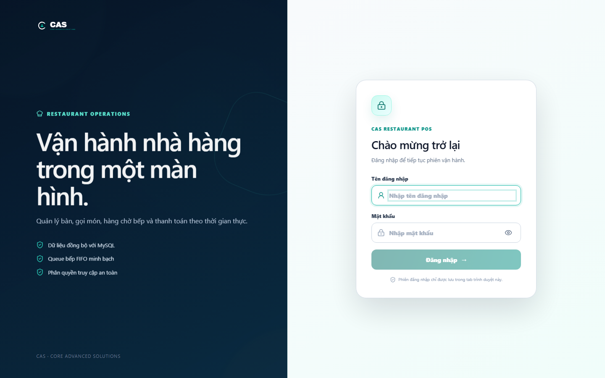
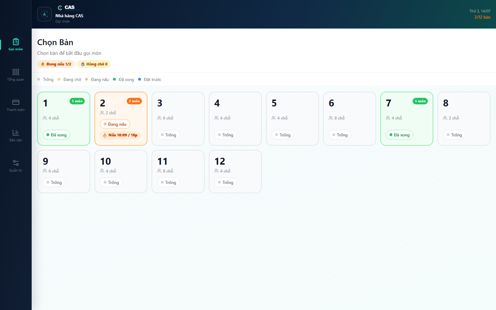
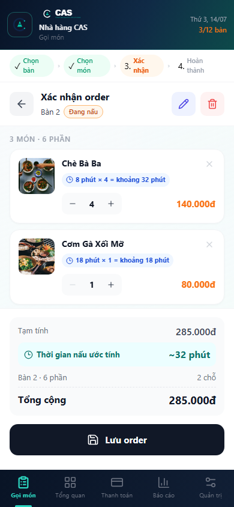
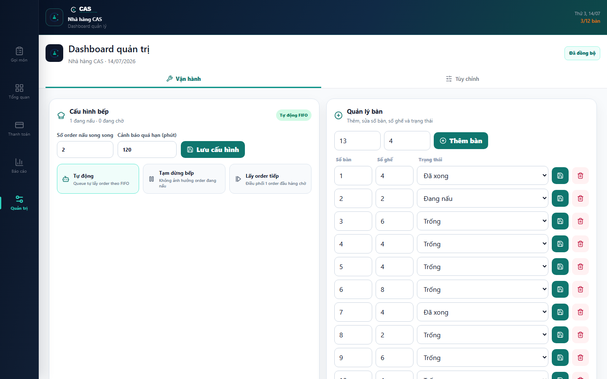
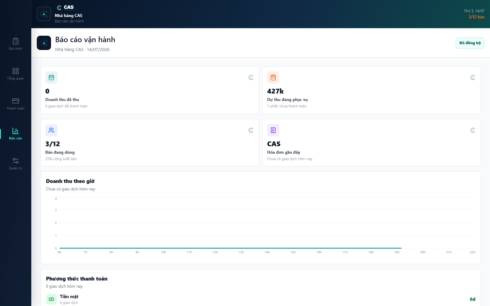
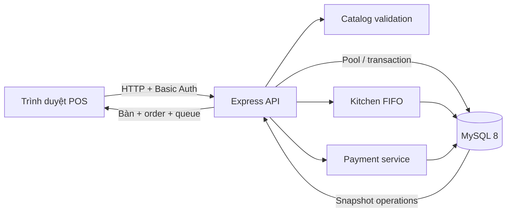
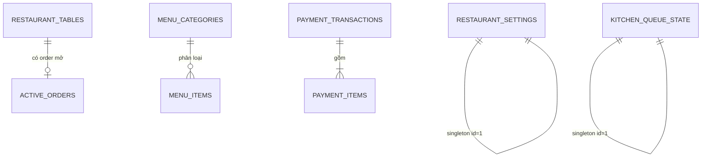

# Restaurant CASv2

Hệ thống POS và điều phối vận hành nhà hàng, gồm gọi món theo bàn, hàng đợi bếp FIFO, thanh toán, hóa đơn A4, báo cáo trong ngày và Dashboard quản trị. Dữ liệu nghiệp vụ được lưu tại MySQL; frontend không tự quyết định giá, tổng tiền hoặc ETA cuối cùng.

## Tổng quan

| Thành phần | Công nghệ | Vai trò |
|---|---|---|
| Web | React 18, TypeScript, Vite | Gọi món, bàn, bếp, thanh toán, báo cáo và quản trị |
| API | Node.js, Express | Xác thực, validation, transaction và nghiệp vụ queue |
| Database | MySQL 8, InnoDB | Catalog, bàn, order đang mở, cấu hình và giao dịch |
| Biểu đồ | Recharts, lazy-loaded | Báo cáo doanh thu và số đơn theo giờ |
| Giao diện | CSS responsive, Lucide | Desktop, tablet, mobile và bản in A4 |

Trạng thái hiện tại: chạy được end-to-end, 11 unit test và smoke test đều đạt. Cấu trúc phù hợp cho một ứng dụng nội bộ hoặc MVP; phần [Đề xuất trước khi lên production](#đề-xuất-trước-khi-lên-production) liệt kê các bước cần bổ sung khi mở rộng.

## Ảnh giao diện

### Đăng nhập và nhận diện thương hiệu



### Chọn bàn và theo dõi bếp



### ETA theo số lượng trên mobile

ETA của từng dòng hiển thị rõ công thức `thời gian món × số lượng`. Ảnh dưới minh họa `8 phút × 4 phần = khoảng 32 phút`.

<p align="center">
  
</p>

### Điều phối queue bếp



### Báo cáo vận hành



## Chức năng chính

- Chọn bàn, tạo order, sửa số lượng, size, topping và ghi chú.
- Thực đơn và giá được backend đối chiếu lại từ MySQL để ngăn client giả dữ liệu.
- ETA nấu được tính theo số lượng và lưu cùng order.
- Queue bếp FIFO có giới hạn số order nấu song song.
- Chế độ bếp tự động, thủ công, tạm dừng và lấy order tiếp theo.
- Timer chờ/nấu dựa trên timestamp UTC của server.
- Cảnh báo order nấu quá hạn và thao tác xếp lại/hoàn tất.
- Thanh toán tiền mặt, thẻ hoặc QR; backend tính lại giảm giá, phí và VAT.
- Thanh toán và giải phóng bàn chạy trong cùng transaction.
- Hóa đơn A4 có kích thước cố định, không bị co cấu trúc trên màn hình nhỏ.
- Quản lý bàn, món, danh mục, thời gian nấu và cấu hình thương hiệu.
- Báo cáo riêng cho giao dịch trong ngày, phương thức thanh toán và dự thu.
- Giao diện responsive, hỗ trợ `prefers-reduced-motion`.

## Công thức ETA

Với mỗi dòng giỏ hàng:

```text
ETA dòng món = thời gian nấu một phần × số lượng
ETA order     = max(ETA của các dòng món)
```

Ví dụ:

```text
Phở bò: 12 phút × 3 = 36 phút
Gà nướng: 25 phút × 2 = 50 phút
ETA order = max(36, 50) = 50 phút
```

Công thức giả định các loại món khác nhau có thể được chế biến song song, nhưng nhiều phần giống nhau trên cùng một dòng cần thêm thời gian tuyến tính. Frontend chỉ hiển thị preview; backend tính lại ETA từ catalog MySQL và số lượng đã validation.

## Kiến trúc



Các nguyên tắc chính:

1. MySQL là nguồn sự thật; UI polling snapshot `/api/operations` mỗi 3 giây.
2. Những thao tác thay đổi order, queue hoặc payment đều khóa dữ liệu cần thiết bằng transaction InnoDB.
3. Queue được đồng bộ bằng khóa `kitchen_queue_state FOR UPDATE`, không phụ thuộc state trong RAM của một API instance.
4. Toàn bộ timestamp queue được lưu và xử lý theo UTC.
5. Giá, tùy chọn món, tổng thanh toán và ETA đều được backend tính lại.

## Cấu trúc thư mục

```text
Restaurant_CASv2/
├─ apps/
│  ├─ api/
│  │  ├─ src/
│  │  │  ├─ server.js            # HTTP, auth, endpoint và transaction orchestration
│  │  │  ├─ db.js                # Pool, bootstrap schema và migration tương thích
│  │  │  ├─ domain.js            # Validation order/settings và công thức payment
│  │  │  ├─ catalog.js           # Catalog, canonicalization và ETA
│  │  │  ├─ kitchenQueue.js      # Điều phối FIFO có khóa database
│  │  │  └─ defaultSettings.js
│  │  ├─ scripts/smoke.mjs       # Smoke test qua API + MySQL thật
│  │  └─ test/                    # Unit test nghiệp vụ
│  └─ web/
│     ├─ public/brand/            # Asset được Vite phục vụ trực tiếp
│     └─ src/
│        ├─ app/App.tsx           # Điều phối state, polling và navigation
│        ├─ app/data.ts           # Type, seed catalog và helper giỏ hàng
│        ├─ app/reporting.ts      # Lọc/gom dữ liệu báo cáo theo ngày và giờ
│        ├─ app/services/api.ts   # HTTP client có auth và chuẩn hóa lỗi
│        ├─ app/config/           # Brand/settings dùng chung
│        ├─ app/components/       # Màn hình nghiệp vụ
│        └─ styles/                # Theme, responsive và hiệu ứng
├─ database/schema.sql            # Schema bootstrap thủ công
├─ docs/screenshots/              # Ảnh thật dùng trong README
├─ assets/brand/                   # Asset thương hiệu gốc/chất lượng nguồn
├─ assets/invoice-template-source/ # Bản nguồn tham khảo của mẫu hóa đơn
├─ package.json                    # npm workspaces
└─ README.md
```

### Đánh giá tên file và bố cục

- `apps/api` và `apps/web` tách đúng ranh giới backend/frontend.
- `catalog.js`, `domain.js`, `kitchenQueue.js` thể hiện đúng trách nhiệm nghiệp vụ.
- Module demo cũ `dashboardData.ts` đã được thay bằng `reporting.ts` đúng nội dung thực tế.
- 48 component shadcn sinh sẵn nhưng không được import đã được loại bỏ cùng dependency thừa.
- `assets/brand` là bản nguồn; `apps/web/public/brand` là bản được phục vụ runtime. Việc trùng này có chủ đích.
- `App.tsx`, `MenuStep.tsx` và `DashboardPage.tsx` vẫn khá lớn do nhiều inline style. Nên tách thêm khi dự án tiếp tục phát triển, nhưng chưa cần đổi tên/di chuyển ngay vì luồng hiện tại rõ và ổn định.

## Yêu cầu môi trường

- Node.js `>= 20.19`
- npm `>= 10`
- MySQL `8.x`
- Windows, macOS hoặc Linux

## Cài đặt

Tại thư mục gốc:

```powershell
npm install
Copy-Item apps/api/.env.example apps/api/.env
Copy-Item apps/web/.env.example apps/web/.env
```

Chỉnh `apps/api/.env` trước khi chạy. Không commit `.env`.

### Biến môi trường API

| Biến | Mặc định mẫu | Ý nghĩa |
|---|---:|---|
| `PORT` | `4100` | Cổng API |
| `HOST` | `0.0.0.0` | Cho phép máy khác trong LAN kết nối |
| `CORS_ORIGIN` | `http://localhost:5173` | Allowlist origin production, phân cách bằng dấu phẩy |
| `CORS_ALLOW_PRIVATE_NETWORK` | `true` | Chỉ development: cho localhost/IPv6/IP LAN riêng |
| `AUTH_USERNAME` | `admin` | Tài khoản POS |
| `AUTH_PASSWORD` | bắt buộc đổi | Mật khẩu dài và ngẫu nhiên |
| `KITCHEN_CONCURRENCY` | `2` | Công suất bếp khởi tạo |
| `KITCHEN_STALE_MINUTES` | `120` | Ngưỡng cảnh báo order nấu quá lâu |
| `DB_HOST` | `127.0.0.1` | Máy chủ MySQL |
| `DB_PORT` | `3306` | Cổng MySQL |
| `DB_USER` | `root` | User MySQL local |
| `DB_PASSWORD` | bắt buộc đổi | Mật khẩu MySQL |
| `DB_NAME` | `restaurant_casv2` | Tên database |
| `DB_AUTO_MIGRATE` | `true` | Tự bootstrap/migrate khi phát triển |
| `DB_CONNECTION_LIMIT` | `10` | Số connection tối đa trong pool |
| `DB_QUEUE_LIMIT` | `100` | Số request chờ connection |
| `LEGACY_TIMEZONE_OFFSET_MINUTES` | `420` | Chỉ dùng một lần khi đổi timestamp legacy sang UTC |

### Biến môi trường web

| Biến | Giá trị | Ý nghĩa |
|---|---|---|
| `VITE_API_BASE_URL` | để trống | Dùng `/api` cùng domain hoặc Vite proxy |
| `VITE_DEV_API_TARGET` | `http://127.0.0.1:4100` | Đích proxy khi chạy dev |

## Database và migration

Chạy migration chủ động:

```powershell
npm run db:migrate
```

Hoặc chạy schema bằng MySQL CLI:

```powershell
npm run db:schema
```

`db:schema` hỏi mật khẩu tương tác và không đặt mật khẩu trên command line.

### Quan hệ dữ liệu



| Bảng | Vai trò | Ràng buộc/index đáng chú ý |
|---|---|---|
| `restaurant_tables` | Số bàn, ghế và trạng thái | PK `id`, unique `table_number`, index `status` |
| `active_orders` | Một order đang mở cho mỗi bàn | unique `table_id`, FK bàn, index FIFO `(queued_at, id)` |
| `kitchen_queue_state` | Công suất/chế độ queue | Một hàng `id=1`, khóa bằng `FOR UPDATE` |
| `menu_categories` | Danh mục món | PK `id`, thứ tự và trạng thái active |
| `menu_items` | Giá, ETA, size, topping | FK category, index category/available |
| `restaurant_settings` | Thương hiệu và hóa đơn | JSON, một hàng `id=1` |
| `payment_transactions` | Header hóa đơn đã trả | unique `invoice_code`, index `paid_at` |
| `payment_items` | Chi tiết món đã thanh toán | FK transaction, `ON DELETE CASCADE` |
| `schema_migrations` | Đánh dấu migration dữ liệu | PK migration id |

Audit trực tiếp database ngày 14/07/2026 cho kết quả `0` ở cả sáu nhóm lỗi: bàn active không có order, order gắn sai trạng thái bàn, JSON order lỗi, tổng payment sai công thức, payment thiếu item và lệch `item_count`.

## Chạy development

Mở hai terminal:

```powershell
npm run dev:api
```

```powershell
npm run dev:web
```

- Web: `http://localhost:5173`
- API health: `http://127.0.0.1:4100/api/health`

## Dùng trên điện thoại hoặc máy khác trong Wi-Fi

1. Chạy API và web như trên.
2. Dùng `ipconfig` để lấy IPv4 của máy chạy dự án.
3. Mở `http://<IPv4>:5173` trên thiết bị khác.
4. Cho phép Node.js qua Windows Firewall ở mạng Private nếu được hỏi.

Development cho phép `localhost`, `127.x`, IPv6 loopback, `10.x`, `192.168.x` và `172.16-31.x` khi `CORS_ALLOW_PRIVATE_NETWORK=true`. Production luôn yêu cầu origin nằm chính xác trong `CORS_ORIGIN`.

## Luồng nghiệp vụ

### Gọi món và queue bếp

1. Client gửi danh sách món và số lượng.
2. Backend validation giới hạn 1–100 dòng, mỗi dòng 1–99 phần.
3. Backend tải lại catalog theo id, thay toàn bộ giá/size/topping client bằng dữ liệu MySQL.
4. Backend tính `ETA dòng = cookMinutes × quantity` và lấy dòng lâu nhất.
5. Order được upsert; bàn chuyển sang `waiting` nếu chưa nấu.
6. Queue khóa `kitchen_queue_state`, đếm slot trống và lấy order FIFO.
7. Order được lấy chuyển `waiting → cooking` và ghi `cooking_started_at`.
8. Khi hoàn tất, bàn chuyển `cooking → done`; queue tự lấy order tiếp theo nếu đang ở chế độ tự động.

### Thanh toán

1. Client dựng preview hóa đơn và gửi mã idempotency/phương thức.
2. Backend khóa bàn và order trong transaction.
3. Backend đọc lại settings và tính subtotal, discount, service fee, VAT, total.
4. Header và item payment được ghi vào MySQL.
5. Active order bị xóa, bàn trở về `empty`, queue được chạy tiếp.
6. Chỉ sau khi commit thành công frontend mới cho in hóa đơn.

### Báo cáo

- Frontend yêu cầu giao dịch theo khoảng UTC tương ứng với ngày địa phương.
- API dùng index `paid_at` và trả tối đa 1.000 giao dịch/ngày.
- Dashboard chỉ cộng giao dịch thuộc ngày đang hiển thị.
- Biểu đồ Recharts chỉ được tải khi người dùng mở trang Báo cáo.

## API chính

Mọi endpoint `/api/*`, trừ health, đều yêu cầu xác thực khi auth được cấu hình.

| Method | Endpoint | Chức năng |
|---|---|---|
| `GET` | `/api/health` | Kiểm tra API/MySQL |
| `GET` | `/api/auth/session` | Kiểm tra phiên Basic Auth |
| `GET/PUT` | `/api/settings` | Đọc/lưu cấu hình nhà hàng |
| `GET` | `/api/catalog` | Lấy danh mục và món |
| `POST` | `/api/catalog/bootstrap` | Seed catalog nếu database trống |
| `POST/PUT/DELETE` | `/api/categories` | Quản lý danh mục |
| `POST/PUT/DELETE` | `/api/menu-items` | Quản lý món/ngừng bán |
| `GET` | `/api/operations` | Snapshot bàn, order và queue |
| `PUT` | `/api/orders/:tableId` | Tạo/cập nhật order |
| `POST` | `/api/orders/:tableId/requeue` | Đưa order đang nấu về cuối queue |
| `DELETE` | `/api/orders/:tableId` | Hủy order chưa nấu |
| `PUT` | `/api/kitchen/config` | Công suất, auto/manual, pause |
| `POST` | `/api/kitchen/dispatch-next` | Lấy một order đầu queue |
| `POST/PUT/DELETE` | `/api/tables` | Quản lý bàn |
| `PATCH` | `/api/tables/:tableId/status` | Hoàn tất order đang nấu |
| `GET` | `/api/payments?from=&to=` | Giao dịch trong khoảng thời gian |
| `POST` | `/api/payments` | Thanh toán idempotent |

## Scripts

| Lệnh | Tác dụng |
|---|---|
| `npm run dev:api` | API với Node watch mode |
| `npm run dev:web` | Vite dev server trên `0.0.0.0` |
| `npm run db:migrate` | Bootstrap/migrate MySQL |
| `npm run typecheck` | TypeScript strict check |
| `npm test` | Unit test backend |
| `npm run test:smoke` | Test end-to-end qua API/MySQL |
| `npm run build` | Build frontend production |
| `npm run check` | Typecheck + unit test + build |
| `npm audit --audit-level=high` | Audit dependency |

## Kiểm thử và chất lượng

```powershell
npm run typecheck
npm test
npm run test:smoke
npm run build
npm audit --audit-level=high
```

Phạm vi unit test hiện tại:

- Canonicalization catalog và chống giả giá/topping.
- Validation category, menu, quantity, VAT và thời gian nấu.
- ETA theo số lượng và lấy dòng lâu nhất.
- Queue đủ slot, pause, manual và automatic.
- Cảnh báo order stale.
- Công thức payment và thời gian server.

Smoke test tạo bàn tạm, tạo order số lượng 2, kiểm tra ETA, chạy queue, hoàn tất/hủy và dọn dữ liệu.

## Hiệu năng

Kết quả đo local ngày 14/07/2026, mang tính tham khảo chứ không phải SLA production:

| Chỉ số | Kết quả |
|---|---:|
| Main JS trước tối ưu | 255,18 KB / 72,86 KB gzip |
| Main JS sau lazy-load | 188,39 KB / 60,63 KB gzip |
| Main CSS trước dọn UI thừa | 104,58 KB / 18,55 KB gzip |
| Initial CSS sau dọn | 26,19 KB / 6,71 KB gzip |
| Transfer màn login production local | khoảng 70,9 KB |
| First Contentful Paint local | khoảng 52 ms |
| JS heap màn login | khoảng 20,1 MB |
| API process working set | khoảng 72 MB |
| `/api/operations` payload | khoảng 3,0 KB |
| `/api/operations` p50 / p95, 30 mẫu | 1,51 ms / 3,29 ms |
| `/api/catalog` payload | khoảng 7,7 KB |
| `/api/catalog` p50 / p95, 30 mẫu | 1,11 ms / 1,51 ms |

Các tối ưu đã áp dụng:

- Lazy-load Menu, Xác nhận, Thành công, Tổng quan, Thanh toán, Dashboard và biểu đồ.
- Recharts nằm ở chunk riêng và chỉ tải khi mở Báo cáo.
- Ảnh menu ngoài viewport dùng `loading="lazy"` và `decoding="async"`.
- Polling không chạy khi tab trình duyệt bị ẩn và không cho request chồng nhau.
- Xóa 48 component UI không dùng và 151 package đã cài thừa.
- Query FIFO và báo cáo dùng index phù hợp.
- Giới hạn JSON body `256 KB`, payment list theo ngày tối đa 1.000 bản ghi.

Vite development dùng nhiều RAM hơn build production do HMR, source map và module graph; không nên dùng mức RAM của `npm run dev:web` để đánh giá server production.

## Đánh giá giao diện

Giao diện hiện tại phù hợp với desktop 1440×900 và mobile 390×844, không có tràn ngang ở các màn đã kiểm tra. Login thể hiện thương hiệu tốt; màu thương hiệu và nền quản trị có đủ phân tách; form settings lớn hơn và chia hai cột ở desktop; bottom navigation chuyển thành sidebar trên màn hình lớn.

Các nguyên tắc đã có:

- Touch target chính khoảng 40–48 px.
- Grid dùng `auto-fill/minmax` cho bàn và món.
- Navigation desktop/mobile khác bố cục nhưng cùng chức năng.
- Hiệu ứng được tắt gần như hoàn toàn khi người dùng bật reduced motion.
- Hóa đơn giữ kích thước A4 và cho phép cuộn ngang ở viewport hẹp.

Hiệu chuẩn nên làm tiếp khi có thiết bị thật: tablet 768 px, màn POS cảm ứng 1024 px, kiểm thử bàn phím toàn bộ modal, WCAG contrast tự động và cỡ chữ cho người dùng lớn tuổi.

## Đề xuất trước khi lên production

Ưu tiên cao:

1. Thay Basic Auth bằng session cookie `HttpOnly/Secure/SameSite` hoặc OIDC; bổ sung role quản lý, thu ngân, phục vụ và bếp.
2. Tách migration khỏi `db.js` sang công cụ migration có version/rollback; hiện schema tồn tại cả trong `db.js` và `database/schema.sql`, có nguy cơ lệch khi thay đổi lớn.
3. Bổ sung audit log cho đổi giá, đổi trạng thái bàn, pause queue, hủy order và thanh toán.
4. Thêm integration test transaction thật và E2E trình duyệt cho order → queue → payment.

Ưu tiên mở rộng nghiệp vụ:

1. Chuẩn hóa `active_order_items` thay cho JSON nếu cần tồn kho, bếp theo từng món hoặc báo cáo chi tiết order chưa thanh toán.
2. Tách trạng thái order khỏi trạng thái bàn để hỗ trợ nhiều order/bàn hoặc tách/gộp bàn.
3. Tạo API aggregate báo cáo khi vượt 1.000 giao dịch/ngày và thêm phân trang payment.
4. Thêm nhân viên/ca làm việc thay vì một tên nhân viên trong settings.
5. Thêm tồn kho, định lượng món, hủy từng món và lịch sử sửa order.

Ưu tiên kỹ thuật/UI:

1. Tách các file trên 500 dòng thành feature folder và chuyển inline style lặp lại thành CSS module/design token.
2. Thay `window.confirm` còn lại trong quản trị bằng dialog theo nhận diện CAS.
3. Dùng SSE/WebSocket khi số client tăng để giảm polling 3 giây.
4. Tự host hoặc đưa ảnh món lên CDN có WebP/AVIF, kích thước responsive và fallback ổn định.
5. Bổ sung PWA/offline queue nếu POS phải hoạt động khi mạng nội bộ chập chờn.

## Bảo mật production

- Chạy API sau HTTPS/reverse proxy; không dùng Basic Auth qua HTTP công cộng.
- Đặt `NODE_ENV=production`, password/secret qua secret manager.
- Production phải đặt allowlist `CORS_ORIGIN` cụ thể; không bật private-network wildcard.
- Chạy migration bằng user có quyền DDL, sau đó đặt `DB_AUTO_MIGRATE=false`.
- API runtime nên dùng MySQL user quyền tối thiểu.
- Thiết lập backup, restore drill, log tập trung và monitor `/api/health`.
- Giới hạn truy cập MySQL ở private network và bật firewall.

## Xử lý lỗi thường gặp

### `Origin không được phép`

- Development: kiểm tra `CORS_ALLOW_PRIVATE_NETWORK=true`, restart API và chắc chắn origin thuộc localhost/IP LAN riêng.
- Production: thêm chính xác protocol, host và port frontend vào `CORS_ORIGIN`, ví dụ `https://pos.example.com`.
- Nếu dùng Vite proxy và `VITE_API_BASE_URL` để trống, trình duyệt chỉ gọi cùng origin `/api`, thường không cần CORS trực tiếp.

### API trả `503 DATABASE_UNAVAILABLE`

- Kiểm tra MySQL đang chạy.
- Kiểm tra `DB_HOST`, `DB_PORT`, `DB_USER`, `DB_PASSWORD`, `DB_NAME`.
- Chạy `npm run db:migrate` và xem log API.

### Đăng nhập luôn thất bại

- Kiểm tra `AUTH_USERNAME`, `AUTH_PASSWORD` trong `apps/api/.env`.
- Restart API sau khi đổi `.env`.
- Credential chỉ lưu trong `sessionStorage`; mở tab mới cần đăng nhập lại.

### Điện thoại không mở được web

- Dùng IPv4 của máy chạy Vite, không dùng `localhost` trên điện thoại.
- Cả hai thiết bị phải cùng mạng.
- Cho phép Node.js qua firewall mạng Private.

## Credits

- Asset thương hiệu CAS nằm trong `assets/brand`.
- Ảnh món mẫu dùng nguồn Unsplash; xem `apps/web/ATTRIBUTIONS.md`.
- Icon giao diện dùng Lucide.
